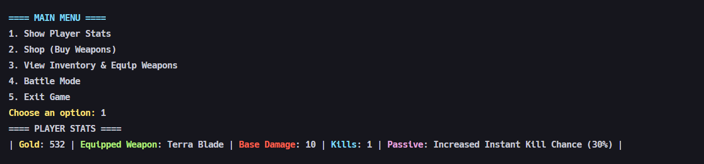

# Sisop-3-2025-IT10

## Member

| No  | Nama                   | NRP        |
| --- | ---------------------- | ---------- |
| 1   | Ardhi Putra Pradana    | 5027241022 |
| 2   | Aslam Ahmad Usman      | 5027241074 |
| 3   | Kanafira Vanesha Putri | 5027241010 |

## Reporting

### Soal 1

**Dikerjakan oleh: Ardhi Putra Pradana (5027241022)**

#### Penjelasan

**Server - image_client.c**

Untuk langkah pertama adalah membuat RPC `server` yang dapat berjalan secara daemon, dengan function daemon berikut ini

```c
void daemonize() {
    pid_t pid = fork();
    int status;

    if (pid < 0) exit(1);
    if (pid > 0) exit(0);
    if (setsid() < 0) exit(1);

    umask(0);
    for (int x = sysconf(_SC_OPEN_MAX); x > 0; x--) close(x);
}
```

Dan karena berjalan secara daemon dan handle dari tiap socket connection dilakukan oleh child process, maka diperlukan signal untuk bisa melakukan kill process setelah connection dari client terputus agar tidak terjadi zombie process, yaitu dengan beberapa hal berikut ini

```c
void reap_zombies(int sig) {
    while (waitpid(-1, NULL, WNOHANG) > 0);
}
```

Lalu pada bagian atas function `main` diberikan kode berikut untuk melakukan handle daemon dan process signalnya

```c
daemonize();

struct sigaction sa;
sa.sa_handler = reap_zombies;
sigemptyset(&sa.sa_mask);
sa.sa_flags = SA_RESTART | SA_NOCLDSTOP;
sigaction(SIGCHLD, &sa, NULL);
```

Kemudian membuat function membuat `listening socket connection`, dengan function berikut ini

```c
int make_socket() {
    struct sockaddr_in address;
    int sockfd;
    socklen_t addrlen = sizeof(address);

    if ((sockfd = socket(AF_INET, SOCK_STREAM, 0)) < 0) return -1;

    address.sin_family = AF_INET;
    address.sin_addr.s_addr = htonl(INADDR_ANY);
    address.sin_port = htons(PORT);

    int opt = 1;
    setsockopt(sockfd, SOL_SOCKET, SO_REUSEADDR, &opt, sizeof(opt));

    if ((bind(sockfd, (struct sockaddr *)&address, addrlen)) < 0) return -1;
    if (listen(sockfd, 5) < 0) return -1;

    return sockfd;
}
```

Setelah itu membuat function `handler` sebagai gate untuk semua action yang dapat dilakukan dan dikirim dari client ke server, yaitu sebagai berikut

```c
void handler(int sock) {
    char action[1024];
    while (1) {
        ssize_t buflen = recv(sock, action, sizeof(action), 0);
        if (buflen <= 0) break;
        action[buflen] = '\0';
        if (action[buflen - 1] == '\n') action[buflen - 1] = '\0';
        if (strcmp(action, "exit") == 0) {
            logger("Client", "EXIT", "Client requested to exit");
            break;
        } else if (strcmp(action, "decode") == 0) {
            decoder_file(sock);
        } else if (strcmp(action, "download") == 0) {
            downloader_file(sock);
        }
    }
}
```

Inti dari function diatas adalah untuk melakukan pengkondisian sebagai acuan kira - kira fitur apa yang perlu dieksekusi dan melakukan respon ke client, jadi handler ini akan membaca buffer dari client, dan mencocokkan actionnya yaitu ada _exit, decode, dan download_, setelah itu akan memanggil handler functionnya masing - masing.

Pertama masuk ke bagian untuk melakukan decode file yang dikirim dari client, yaitu handlernya sebagai berikut

```c
int decoder_file(int sock) {
    logger("Client", "DECRYPT", "Text data");

    char *folder = "database";
    struct stat st;
    if (stat(folder, &st) == -1) {
        if (mkdir(folder, 0700) == -1) return -1;
    };

    time_t timestamp = time(NULL);
    char strtime[32];
    char filename[64];
    char filepath[128];

    snprintf(strtime, sizeof(strtime), "%ld", timestamp);
    snprintf(filename, sizeof(filename), "%s.jpeg", strtime);
    snprintf(filepath, sizeof(filepath), "%s/%s", folder, filename);

    char size_buffer[32];
    ssize_t size_len = recv(sock, size_buffer, sizeof(size_buffer) - 1, 0);
    if (size_len <= 0) return -1;
    size_buffer[size_len] = '\0';
    size_t expected_size = strtoul(size_buffer, NULL, 10);

    if (recvto_file(sock, filepath, expected_size) < 0) return -1;

    long file_size;
    char *file_content = read_file(filepath, &file_size);
    if (!file_content) return -1;

    revstr(file_content);

    unsigned char *decoded;
    size_t decoded_size = hexs2bin(file_content, &decoded);
    if (decoded_size == 0) {
        free(file_content);
        free(decoded);
        return -1;
    }

    write_file(filepath, (char *)decoded, decoded_size);

    free(file_content);
    free(decoded);

    char message[128];
    snprintf(message, sizeof(message), "Text decrypted and saved as %s", filename);
    send(sock, message, strlen(message), 0);

    logger("Client", "SAVE", filename);
    return 0;
}
```

Disini function tersebut akan menyimpan base directory filenya yaitu di `database` kemudian membuat schema filename yaitu menggunakan current timestamp, kemudian mulai membaca content dari client, pertama membaca `size` buffernya terlebih dahulu, setelah itu memanggil function `recvto_file` dan melakukan read kembali isi file tersebut melakukan reversing string dan melakukan decode hex nya dan menyimpannya kembali.

```c
int recvto_file(int sock, char *filename, size_t size) {
    FILE *fp;
    char buffer[1024];
    size_t total_received = 0;
    int threshold = 50;

    fp = fopen(filename, "wb");
    if (!fp) return -1;

    while (total_received < size - threshold) {
        size_t remaining = size - total_received;
        size_t to_recv = sizeof(buffer);
        if (remaining < to_recv) to_recv = remaining;

        ssize_t buflen;
        do {
            buflen = recv(sock, buffer, to_recv, 0);
        } while (buflen == -1 && errno == EINTR);

        if (buflen <= 0) {
            fflush(fp);
            fclose(fp);
            return -1;
        }

        fwrite(buffer, 1, buflen, fp);
        total_received += buflen;
    }

    fflush(fp);
    fclose(fp);
    return 0;
}
```

Diatas adalah function untuk melakukan read dari setiap buffer content dari client sesuai dengan size yang dipassing dari argumentnya, dan lalu melakukan writing ke file targetnya.

```c
char *read_file(char *filename, long *file_size) {
    FILE *file = fopen(filename, "r");
    if (file == NULL) {
        return NULL;
    }

    fseek(file, 0, SEEK_END);
    *file_size = ftell(file);
    rewind(file);

    char *buffer = (char *)malloc(*file_size + 1);
    if (buffer == NULL) {
        fflush(file);
        fclose(file);
        return NULL;
    }

    size_t bytes_read = fread(buffer, 1, *file_size, file);
    if (bytes_read != *file_size) {
        free(buffer);
        fflush(file);
        fclose(file);
        return NULL;
    }

    buffer[bytes_read] = '\0';

    fflush(file);
    fclose(file);
    return buffer;
}

int write_file(char *filename, char *content, size_t size) {
    FILE *fp = fopen(filename, "wb");
    if (!fp) return -1;
    fwrite(content, 1, size, fp);
    fflush(fp);
    fclose(fp);
}
```

Diatas adalah function untuk melakukan handle write dan read file. Dan berikut adalah function yang digunakan untuk melakukan reversing dan melakukan decode hex contentnya

```c
void revstr(char *str) {
    if (!str) return;
    int i = 0;
    int j = strlen(str) - 1;
    while (i < j) {
        char c = str[i];
        str[i] = str[j];
        str[j] = c;
        i++;
        j--;
    }
}

// https://nachtimwald.com/2017/09/24/hex-encode-and-decode-in-c/#hex-to-binary
int hexchr2bin(char hex, char *out) {
    if (out == NULL)
        return 0;

    if (hex >= '0' && hex <= '9') {
        *out = hex - '0';
    } else if (hex >= 'A' && hex <= 'F') {
        *out = hex - 'A' + 10;
    } else if (hex >= 'a' && hex <= 'f') {
        *out = hex - 'a' + 10;
    } else {
        return 0;
    }

    return 1;
}

size_t hexs2bin(char *hex, unsigned char **out) {
    size_t len;
    char b1, b2;
    size_t i;

    if (hex == NULL || *hex == '\0' || out == NULL)
        return 0;

    len = strlen(hex);
    if (len % 2 != 0)
        return 0;
    len /= 2;

    *out = malloc(len + 1);
    if (*out == NULL)
        return 0;

    for (i = 0; i < len; i++) {
        if (!hexchr2bin(hex[i * 2], &b1) || !hexchr2bin(hex[i * 2 + 1], &b2)) {
            free(*out);
            *out = NULL;
            return 0;
        }
        (*out)[i] = (b1 << 4) | b2;
    }

    (*out)[len] = '\0';

    return len;
}
```

Setelah itu masuk ke bagian untuk melakukan handle dari request download client, gate function utamanya adalah sebagai berikut

```c
int downloader_file(int sock) {
    char filename[128];
    char filepath[256];
    char *folder = "database";

    ssize_t buflen = recv(sock, filename, sizeof(filename) - 1, 0);
    if (buflen <= 0) return -1;
    filename[buflen] = '\0';
    if (filename[buflen - 1] == '\n') filename[buflen - 1] = '\0';

    logger("Client", "DOWNLOAD", filename);

    snprintf(filepath, sizeof(filepath), "%s/%s", folder, filename);
    struct stat st;
    if (stat(filepath, &st) == -1) {
        char message[128];
        snprintf(message, sizeof(message), "Gagal menemukan file untuk dikirim ke client");
        send(sock, message, strlen(message), 0);
        return -1;
    }

    send_file(sock, filepath);

    logger("Server", "UPLOAD", filename);
    return 0;
}
```

Handler tersebut akan membaca nama file yang dikirim dari client dan memeriksa apakah benar - benar ada disisi database server, jika ada maka akan mengembalikan atau melakukan send buffer ke client, yaitu dengan melakukan size terlebih dahulu lalu contentnya. Untuk melakukan send tersebut function ini memanggil function lain yaitu `send_file`

```c
int send_file(int sock, const char *filename) {
    FILE *fp = fopen(filename, "rb");
    if (!fp) return -1;

    fseek(fp, 0, SEEK_END);
    long file_size = ftell(fp);
    rewind(fp);

    char size_str[32];
    snprintf(size_str, sizeof(size_str), "%ld\n", file_size);

    if (send(sock, size_str, strlen(size_str), 0) < 0) {
        fflush(fp);
        fclose(fp);
        return -1;
    }
    sleep(0.1);

    char *buffer = malloc(file_size);
    if (!buffer) {
        fflush(fp);
        fclose(fp);
        return -1;
    }

    size_t read_size = fread(buffer, 1, file_size, fp);
    fflush(fp);
    fclose(fp);

    if (read_size != file_size) {
        free(buffer);
        return -1;
    }

    if (send(sock, buffer, file_size, 0) < 0) {
        free(buffer);
        return -1;
    }

    free(buffer);
    return 0;
}
```

Kemudian untuk logic loggernya sebagai berikut ini

```c
void logger(char *from, char *type, char *msg) {
    FILE *fp = fopen("server.log", "a");
    if (fp == NULL) return;
    time_t now = time(NULL);
    struct tm *tm_info = localtime(&now);
    char time_str[32];
    strftime(time_str, sizeof(time_str), "%Y-%m-%d %H:%M:%S", tm_info);
    fprintf(fp, "[%s][%s] [%s]: [%s]\n", time_str, from, type, msg);
    fflush(fp);
    fclose(fp);
}
```

Logger function tersebut akan dipanggil dibeberapa function yang ada untuk memberikan info logging yang sesuai dengan aktifitas yang dilakukan oleh server atau dari client ke server.

Lalu semua hal tersebut akan dibungkus menjadi di 1 function `main` sebagai berikut ini

```c
int main(int argc, char *argv[]) {
    daemonize();

    struct sigaction sa;
    sa.sa_handler = reap_zombies;
    sigemptyset(&sa.sa_mask);
    sa.sa_flags = SA_RESTART | SA_NOCLDSTOP;
    sigaction(SIGCHLD, &sa, NULL);

    int sockfd = make_socket();
    if (sockfd < 0) {
        perror("socket setup failed");
        exit(EXIT_FAILURE);
    }

    struct sockaddr_in client_addr;
    socklen_t addr_len = sizeof(client_addr);

    while (1) {
        int client_sock = accept(sockfd, (struct sockaddr *)&client_addr, &addr_len);
        if (client_sock < 0) continue;

        pid_t pid = fork();
        if (pid < 0) {
            close(client_sock);
            continue;
        } else if (pid == 0) {
            close(sockfd);
            handler(client_sock);
            close(client_sock);
            exit(0);
        } else {
            close(client_sock);
        }
    }

    close(sockfd);
    return 0;
}
```

**Client - image_client.c**

Sebagai besar hal yang ada diclient sebanarnya adalah sama dengan yang diserver, namun hanya process nya yang sedikit dibalik, namun penggunaan function dan deklarasi functionnya memiliki kemiripan atau bahkan sama.

Pertama membuat function untuk bisa melakukan connection socket ke server, yaitu sebagai berikut

```c
int connect_socket() {
    int sockfd;
    struct sockaddr_in address;

    if ((sockfd = socket(AF_INET, SOCK_STREAM, 0)) < 0) return -1;

    address.sin_family = AF_INET;
    address.sin_port = htons(PORT);
    address.sin_addr.s_addr = inet_addr(HOST);

    if (connect(sockfd, (struct sockaddr *)&address, sizeof(address)) < 0) return -1;

    return sockfd;
}
```

Lalu untuk handler nya sebagai berikut ini

```c
int handler(int sockfd, int opt) {
    char *folder = "secrets";
    char filename[256];

    char target[512];

    switch (opt) {
        case 1:
            printf("Enter the file name: ");
            scanf("%s", filename);
            snprintf(target, sizeof(target), "%s/%s", folder, filename);
            if (send(sockfd, "decode\n", strlen("decode\n"), 0) < 0) return -1;
            if (send_file(sockfd, target) < 0) return -1;

            char res[256];
            ssize_t res_len = recv(sockfd, res, sizeof(res), 0);
            if (res_len <= 0) break;
            res[res_len] = '\0';
            printf("Server: %s\n\n", res);
            break;
        case 2:
            printf("Enter the file name to download: ");
            scanf("%s", filename);
            if (send(sockfd, "download\n", strlen("download\n"), 0) < 0) return -1;
            snprintf(target, sizeof(target), "%s\n", filename);
            sleep(0.1);
            if (send(sockfd, target, strlen(target), 0) < 0) return -1;

            char size_buffer[128];
            ssize_t size_len = recv(sockfd, size_buffer, sizeof(size_buffer) - 1, 0);
            if (size_len <= 0) break;
            size_buffer[size_len] = '\0';

            if (strlen(size_buffer) > 10) {
                printf("Server: %s\n\n", size_buffer);
                break;
            }

            size_t expected_size = strtoul(size_buffer, NULL, 10);

            if (recvto_file(sockfd, filename, expected_size) < 0) return -1;
            break;
        case 3:
            if (send(sockfd, "exit\n", strlen("exit\n"), 0) < 0) return -1;
            close(sockfd);
            exit(EXIT_SUCCESS);
            return 0;
        default:
            printf("Invalid option, try again\n\n");
    }

    return 0;
}
```

Terdapat 3 handler opt disana yaitu **1** untuk meminta request ke server untuk melakukan decode filenya, **2** untuk mendownload file dari server, dan **3** untuk exit.

Untuk bagian **1** yaitu decode, maka handler tersebut akan meminta input nama file dari user, kemudian mengirimkan action **decode** dan lalu memanggil **send_file** sesuai dengan nama file yang diinput oleh user, yaitu sebagai berikut ini

```c
int send_file(int sockfd, const char *filename) {
    struct stat st;
    if (stat(filename, &st) < 0) {
        printf("Salah nama text file input\n\n");
        return -1;
    }

    FILE *fp = fopen(filename, "rb");
    if (!fp) return -1;

    fseek(fp, 0, SEEK_END);
    long file_size = ftell(fp);
    rewind(fp);

    char size_str[32];
    snprintf(size_str, sizeof(size_str), "%ld\n", file_size);

    if (send(sockfd, size_str, strlen(size_str), 0) < 0) {
        fflush(fp);
        fclose(fp);
        return -1;
    }
    sleep(0.1);

    char *buffer = malloc(file_size);
    if (!buffer) {
        fflush(fp);
        fclose(fp);
        return -1;
    }

    size_t read_size = fread(buffer, 1, file_size, fp);
    fflush(fp);
    fclose(fp);

    if (read_size != file_size) {
        free(buffer);
        return -1;
    }

    if (send(sockfd, buffer, file_size, 0) < 0) {
        free(buffer);
        return -1;
    }

    free(buffer);
    return 0;
}
```

Setelah itu client akan melakukan recv buffer dari server untuk mendapatkan response message dari server itu sendiri.

Lalu untuk **2** yaitu melakukan download, maka client akan meminta input dari user yaitu nama file yang ada pada database server, kemudian mengirimkan action **download** ke server, dan setelah itu lalu mengirimkan nama file yang diinput oleh user ke server, dan kemudian karena server akan memberikan response sebuah `size` jika berhasil, maka dicek terlebih dahulu jika length dari response nya lebih dari 10 maka sebenarnya yang diresponse oleh server bukanlah `size` melainkan `error message`, oleh karena itu akan diprint ke console, namun jika valid maka akan memanggil function `recvto_file`, yaitu sebagai berikut

```c
int recvto_file(int sock, char *filename, size_t size) {
    FILE *fp;
    char buffer[1024];
    size_t total_received = 0;
    int threshold = 50;

    fp = fopen(filename, "wb");
    if (!fp) return -1;

    while (total_received < size - threshold) {
        size_t remaining = size - total_received;
        size_t to_recv = sizeof(buffer);
        if (remaining < to_recv) to_recv = remaining;

        ssize_t buflen;
        do {
            buflen = recv(sock, buffer, to_recv, 0);
        } while (buflen < 0 && errno == EINTR);

        if (buflen <= 0) {
            perror("error receiving file");
            fflush(fp);
            fclose(fp);
            return -1;
        }

        fwrite(buffer, 1, buflen, fp);
        total_received += buflen;
    }

    fflush(fp);
    fclose(fp);
    return 0;
}
```

Logicnya sama persis dengan yang ada diserver.

Semua hal tadi dicombine ke `main` function sebagai berikut

```c
int main(int argc, char *argv[]) {
    int sockfd = connect_socket();

    if (sockfd < 0) {
        printf("Gagal connect ke server\n\n");
        exit(EXIT_FAILURE);
    }
    printf("Connected to address %s:%d\n\n", HOST, PORT);

    int opt;

    while (1) {
        printf("========================\n");
        printf("| Image Decoder Client |\n");
        printf("========================\n");
        printf("1. Send input file to server\n");
        printf("2. Download file from server\n");
        printf("3. Exit\n");
        printf(">>> ");
        scanf("%d", &opt);
        cleanline();
        handler(sockfd, opt);
    }

    close(sockfd);
    return 0;
}
```

Jadi function main akan melakukan while loop untuk menampilkan menu dan meminta input option dari user sesuai dengan menu yang ditampilkan. Untuk error handler bisa dilihat pada deklrasi beberapa function sebelumnya itu sudah memiliki error handlernya masing - masing, lalu untuk memastikan beberapa input adalah number dan tidak memiliki newline, maka disini menggunakan function `cleanline` setelah `scanf` dipanggil

```c
void cleanline() {
    while (getchar() != '\n');
}
```

#### Output

1. Daemonize server


2. Client connected


3. Decode file


4. Download file


5. Log file


6. Error handler


#### Kendala

Tidak ada kendala

### Soal 2

**Dikerjakan oleh: Aslam Ahmad Usman (5027241074)**

#### Penjelasan


**a. Mengunduh File Order dan Menyimpannya ke Shared Memory**

Langkah pertama adalah mengunduh file `delivery_order.csv` yang lalu akan dieksekusi oleh `execvp("sh", args);`. File tersebut lalu akan dibaca dan disimpan ke shared memory di main().

```c
int read_csv(char *filename, Order *orders) {
  if (access("Soal_2/delivery_order.csv", F_OK) != 0) {
    pid_t pid = fork();
    if (pid == 0) {
      char *args[] = {"sh", "-c", "wget --quiet --no-cache --no-cookies --no-check-certificate \"https://docs.google.com/uc?export=download&confirm=$(wget --quiet --no-cache --no-cookies --no-check-certificate 'https://docs.google.com/uc?export=download&id=BU299JKGENW28R' -O- | sed -rn 's/.*confirm=([0-9A-Za-z_]+).*/\\1/p')&id=1OJfRuLgsBnIBWtdRXbRsD2sG6NhMKOg9\" -O Soal_2/delivery_order.csv", NULL};
      execvp("sh", args);
      exit(EXIT_FAILURE);
    } else {
      wait(NULL);
   }
 }

  FILE *fp = fopen("Soal_2/delivery_order.csv", "r");
  if (!fp) {
    perror("fopen");
    return 0;
  }
```

**b. Pengiriman Bertipe Express**

Langkah pertama adalah mendeklarasikan agen-agen sebagai thread yang terpisah yang akan menjalankan fungsi express_order.

```c
 pthread_t express_agents[3];
    char *agent_names[] = {"AGENT A", "AGENT B", "AGENT C"};

    for (int i = 0; i < 3; i++) {
      pthread_create(&express_agents[i], NULL, express_order, agent_names[i]);
    }
```
`pthread_mutex_init(&lock, NULL);` digunakan untuk menginisialisasikan mutex Agar thread yang dijalankan tidak bertabrakan satu sama lain, lalu saat thread mulai mencari order express, pthread_mutex_lock(&lock); digunakan untuk mengunci akses, lalu pthread_mutex_unlock(&lock); digunakan untuk membukanya kembali setelah selesai sehingga thread lain bisa melanjutkan tugasnya.

```c
 pthread_mutex_init(&lock, NULL); 
```

Pencarian penerima dengan tipe express sendiri dilakukan dengan melihat apakah jenis orderannya express dan status orderan masih false. Kalau memenuhi, maka status diubah jadi true, lalu nama agen disimpan dalam delivered_by oleh `strcpy` dan dicatat dalam delivery_log

```c
  while (1) {
  pthread_mutex_lock(&lock);
  bool found = false;

  for (int i = 0; i < MAX_ORDERS; i++) {
   if (strcmp(orders[i].jenis, "Express") == 0 && orders[i].status == false) {
      orders[i].status = true;
      strcpy(orders[i].delivered_by, agent_name);
      write_log(agent_name, orders[i].nama, orders[i].alamat);
      found = true;
      break;
     }
    }
    pthread_mutex_unlock(&lock); 
    if (!found) break;
    sleep(1);
  }
```


**c. Pengiriman Bertipe Reguler**
Pengiriman reguler dapat dilakukan dengan pemanggilan dengan format `./dispatcher -deliver [nama penerima]`, lalu akan dilakukan looping untuk mencari nama penerima yang kita panggil melalui strcmp. Jika penerima ditemukan maka status order-an akan diubah menjadi order (atau sudah delivered) dan menyimpan pengiriman ke dalam log.

```c
else if (strcmp(argv[1], "-deliver") == 0) {
    char *target_name = argv[2];
    char *delivered_by = getenv("USER");

  for (int i = 0; i < total_order; i++) {
     if (strcmp(orders[i].nama, target_name) == 0 && strcmp(orders[i].jenis, "Reguler") == 0) {
        orders[i].status = true;
        if (delivered_by != NULL) {
        strcpy(orders[i].delivered_by, delivered_by);
        }
        printf("Delivering %s by %s\n", orders[i].nama, orders[i].delivered_by);
        write_log(orders[i].delivered_by, orders[i].nama, orders[i].alamat);
        break;
     }  
     else if (strcmp(orders[i].nama, target_name) == 0 && strcmp(orders[i].jenis, "Express") == 0) {
        printf("Command can't deliver an Express orders.\n");
        break;
   }
 }
```

**Mengecek Status Pesanan**

Pengecekan status dilakukan dengan memanggil `./dispatcher -status [nama penerima]`. Lalu dilakukan pencocokan dengan `strcmp`, jika `found = true;` maka akan dicek statusnya antara delivered atau pending. Jika `!found` maka nama penerima/target tidak ditemukan.

```c
if (argc == 3 && strcmp(argv[1], "-status") == 0) {
    char *target = argv[2];
    for (int i = 0; i < MAX_ORDERS; i++) {
      if (strcmp(orders[i].nama, target) == 0) {
          found = true;
          if (orders[i].status == true) {
              printf("Status for %s: Delivered by %s\n", orders[i].nama, orders[i].delivered_by);
          } else {
              printf("Status for %s: Pending\n", orders[i].nama);
          }
          break;
      }    
  } if (!found) {
    printf("Order in the name of %s not found.\n", target);
  } 
```

**e. Melihat Daftar Semua Pesanan**

Untuk mengecek list pengiriman dilakukan dengan memanggil `./dispatcher -list`.  `for (int i = 0; i < MAX_ORDERS; i++)` akan dijalankan untuk menampilkan seluruh list order yang ada. Lalu Baris `if (strlen(orders[i].nama) == 0) continue;` digunakan untuk menghindari entri kosong di array.

```c
else if (argc == 2 && strcmp(argv[1], "-list") == 0) {
    printf("Order List:\n");
    for (int i = 0; i < MAX_ORDERS; i++) {
        if (strlen(orders[i].nama) == 0) continue; 
        printf("- %s: %s (%s)\n", orders[i].nama, orders[i].status == 1 ? "Delivered" : "Pending", orders[i].jenis);
    }    
```

#### Output

1. Mengunduh file delivery_order.csv
   


2. Melakukan pengiriman express
   


3. Melakukan pengiriman reguler


4. Mengecek status pesanan


5. Melihat list pesanan

   
   

#### Kendala

Tidak ada kendala

### Soal 3

**Dikerjakan oleh: Ardhi Putra Pradana (5027241022)**

#### Penjelasan

**Server - dungeon.c & shop.c**

Pertama untuk server adalah membuat socket listener yang ada melakukan listening connection dari client nantinya, yaitu dengan kode sebagai berikut

```c
int make_socket() {
    struct sockaddr_in address;
    int sockfd;
    socklen_t addrlen = sizeof(address);

    if ((sockfd = socket(AF_INET, SOCK_STREAM, 0)) < 0) return -1;

    address.sin_family = AF_INET;
    address.sin_addr.s_addr = htonl(INADDR_ANY);
    address.sin_port = htons(PORT);

    int opt = 1;
    setsockopt(sockfd, SOL_SOCKET, SO_REUSEADDR, &opt, sizeof(opt));

    if ((bind(sockfd, (struct sockaddr *)&address, addrlen)) < 0) return -1;
    if (listen(sockfd, 5) < 0) return -1;

    return sockfd;
}
```

Sebelum melanjutkan, disini akan dilakukan setup untuk beberapa `struct` dan beberapa value `enum` dari simulasi game ini, dan beberapa struct ini dipecah kedalam dua file yaitu ada di file `dungeon.c` dan `shop.c`

_shop.c_

```c

enum WeaponPassive {
    NONE,
    CRITICAL,
    INSTANTKILL,
};

const char *WeaponPassiveStr[] = {
    "NONE",
    "Critical",
    "Instant Kill",
};

struct Weapon {
    char *name;
    int price;
    int damage;

    int hasPassive;
    int passivePercentage;
    enum WeaponPassive passiveType;
};

struct Inventory {
    struct Weapon *weapons;
    int capacity;
    int size;
};

struct Player {
    int gold;
    int kills;

    struct Inventory inventory;
    int equippedWeapon;
};
```

_dungeon.c_

```c
struct Enemy {
    int baseHealth;
    int currentHealth;
};

struct AttackStats {
    int damage;
    int reward;
    int isCritical;
    int isPassive;
    int isDead;

    const char *passive;
    const char *passiveDetail;
};
```

Setelah itu adalah membuat default weapons yang ada atau available yaitu sebagai berikut ini

```c
struct Weapon weapons[5] = {
    {"Terra Blade", 50, 10, 0, 0, NONE},
    {"Flint & Steel", 150, 25, 0, 0, NONE},
    {"Kitchen Knife", 200, 35, 0, 0, NONE},
    {"Staff of Light", 120, 20, 1, 10, CRITICAL},
    {"Terra Blade", 50, 10, 1, 30, INSTANTKILL},
};
```

Jadi akan ada 5 default weapons yang tersedia di `shop` sesuai dengan instruksi soal. Selanjutnya adalah membuat handler untuk setiap action yang akan diberikan oleh client

```c
void handler(int sock) {
    struct Weapon defaultWeapon = {"Fists", 0, 5, 0, 0, NONE};

    struct Inventory inventory = {NULL, 5, 0};
    inventory.weapons = malloc(sizeof(struct Weapon) * inventory.capacity);
    if (inventory.weapons == NULL) return;
    inventory.weapons[inventory.size++] = defaultWeapon;

    struct Player player = {500, 0, inventory, 0};

    char buffer[1024];
    int buflen;
    while (1) {
        buflen = recv(sock, buffer, sizeof(buffer), 0);
        if (buflen <= 0) continue;
        buffer[buflen - 1] = '\0';
        if (strcmp(buffer, "exit") == 0) break;
        if (strcmp(buffer, "stats") == 0) {
            if (get_stats(sock, &player) < 0) continue;
        }
        if (strcmp(buffer, "inventory") == 0) {
            if (get_inventory(sock, &player) < 0) continue;
        }
        if (strcmp(buffer, "change") == 0) {
            if (change_weapon(sock, &player) < 0) continue;
        }
        if (strcmp(buffer, "weapons") == 0) {
            if (available_weapons(sock) < 0) continue;
        }
        if (strcmp(buffer, "buy") == 0) {
            if (buy_weapon(sock, &player) < 0) continue;
        }
        if (strcmp(buffer, "battle") == 0) {
            battle(sock, &player);
            continue;
        }
    }

    free(inventory.weapons);
}
```

Jadi handler ini akan melakukan while loop untuk menerima action input dari user, dan melakukan defaulting value untuk beberapa hal, seperti default weapon, default inventory. Setelah itu pada while loop akan memanggil masing - masing handler sesuai dengan action input dari client tersebut.

Pertama adalah untuk memeriksa `current stats` dari playernya, dan sebagai berikut adalah handler function yang digunakan

```c
int get_stats(int sock, struct Player *player) {
    char buffer[1024];
    snprintf(buffer, sizeof(buffer),
             "Gold=%d;Equipped Weapon=%s;Base Damage=%d;Kills=%d;Passive=%s;Passive Value=%d\n",
             player->gold,
             player->inventory.weapons[player->equippedWeapon].name,
             player->inventory.weapons[player->equippedWeapon].damage,
             player->kills,
             WeaponPassiveStr[player->inventory.weapons[player->equippedWeapon].passiveType],
             player->inventory.weapons[player->equippedWeapon].passivePercentage);
    int len = strlen(buffer);
    if (send(sock, buffer, len, 0) != len) return -1;
}
```

Jadi handler function diatas akan mengirimkan value - value dari object player yang kemudian dikirimkan sebagai string ke client, dengan format - format tertentu seperti yang dapat dilihat pada kode diatas.

Selanjutnya adalah handler untuk `inventory` yaitu sebagai berikut ini

```c
int get_inventory(int sock, struct Player *player) {
    char buffer[1024];
    int len = 0;
    for (int i = 0; i < player->inventory.size; i++) {
        struct Weapon *weapon = &player->inventory.weapons[i];
        len += snprintf(buffer + len, sizeof(buffer) - len,
                        "Name=%s:Passive=%s:Equipped=%d:Passive Value=%d;",
                        weapon->name,
                        WeaponPassiveStr[weapon->passiveType],
                        (player->equippedWeapon == i ? 1 : 0),
                        weapon->passivePercentage);
    }
    buffer[len - 1] = '\0';

    if (send(sock, buffer, len, 0) != len) return -1;
    return 0;
}
```

Pada get inventory ini seperti biasa maka akan menampilkan inventory dari object player saat ini dan mengirimkannya sesuai dengan format ke client.

Selanjutnya adalah handler untuk melakukan `change` weaponnya, yaitu sebagai berikut ini

```c
int change_weapon(int sock, struct Player *player) {
    char buffer[128];
    int len = recv(sock, buffer, sizeof(buffer), 0);
    if (len <= 0) return -1;
    buffer[len - 1] = '\0';
    int index = atoi(buffer);

    if (index < 0 || index >= player->inventory.size) {
        snprintf(buffer, sizeof(buffer), "Invalid weapon index\n");
        send(sock, buffer, strlen(buffer), 0);
        return -1;
    }

    player->equippedWeapon = index;
}
```

Change weapon ini sangat simple sekali, hanya melakukan recv value dari client berupa sebuah index, yang kemudian index tersebut akan disimpan sebagai penunjuk ke inventory weapon dari playernya.

Oke next adalah handler untuk menampilkan `available weapons` yang ada dishop, dan function ini diletakkan pada file `shop.c`, dan sebagai berikut

```c
int available_weapons(int sock) {
    char buffer[1024];
    int len = 0;
    int size = sizeof(weapons) / sizeof(weapons[0]);
    for (int i = 0; i < size; i++) {
        struct Weapon *weapon = &weapons[i];
        len += snprintf(buffer + len, sizeof(buffer) - len,
                        "Name=%s:Price=%d:Damage=%d:Passive=%s:Passive Value=%d;",
                        weapon->name,
                        weapon->price,
                        weapon->damage,
                        WeaponPassiveStr[weapon->passiveType],
                        weapon->passivePercentage);
    }
    buffer[len - 1] = '\0';

    if (send(sock, buffer, len, 0) != len) return -1;
    return 0;
}
```

Sangat strightforward untuk mengirimkan semua available weapons ke client sesuai format.

Next adalah untuk `buy weapon` handlernya sebagai berikut

```c
int buy_weapon(int sock, struct Player *player) {
    char buffer[128];
    int len = recv(sock, buffer, sizeof(buffer), 0);
    if (len <= 0) return -1;
    buffer[len - 1] = '\0';

    int weaponIndex = atoi(buffer);
    if (weaponIndex < 0 || weaponIndex >= sizeof(weapons) / sizeof(weapons[0])) return -1;

    struct Weapon *weapon = &weapons[weaponIndex];
    if (player->gold < weapon->price) {
        snprintf(buffer, sizeof(buffer), "Not enough gold\n");
        send(sock, buffer, strlen(buffer), 0);
        return -1;
    }
    player->gold -= weapon->price;
    player->inventory.weapons[player->inventory.size++] = *weapon;
}
```

Function handler ini akan menerima input dari client yang berupa index dari setiap weapons yang ada dishop, lalu kemudian akan mencocokkan indexnya dan mengurangkan gold dari player tersebut, dan menambahkannya ke inventory.

Dan next, terakhir adalah logic handler untuk melakukan battle

```c
void battle(int sock, struct Player *player) {
    char buffer[1024];
    int buflen;

    struct Enemy enemy;
    int enemyHealth;
    random_enemy(sock, &enemyHealth);
    enemy.baseHealth = enemyHealth;
    enemy.currentHealth = enemyHealth;

    while (1) {
        buflen = recv(sock, buffer, sizeof(buffer), 0);
        if (buflen <= 0) continue;
        buffer[buflen - 1] = '\0';

        if (strcmp(buffer, "exit") == 0) break;
        if (strcmp(buffer, "attack") == 0) {
            attack(sock, player, &enemy);
        }
    }
}
```

Function handler `battle` ini adalah sebagai pintu awal untuk melakukan battle, seperti melakukan setting enemy, dan menerima sub-action ketika sudah memasukki `mode battle` tersebut, dan setelah itu akan memanggil function `attack` ketika menerima input attack, dan exit ketika menerima input exit.

```c
int attack(int sock, struct Player *player, struct Enemy *enemy) {
    srand(time(NULL));
    struct AttackStats attackStats = {0, 0, 0, 0, 0, NULL, NULL};
    struct Weapon *weapon = &player->inventory.weapons[player->equippedWeapon];
    int baseDamage = weapon->damage;

    attackStats.damage = baseDamage;

    // 45% chance for critical hit
    attackStats.isCritical = (rand() % 100) <= 45;
    // 20% chance for passive
    attackStats.isPassive = (rand() % 100) <= 20;

    if (attackStats.isPassive && weapon->hasPassive) {
        attackStats.passive = WeaponPassiveStr[weapon->passiveType];
        if (weapon->passiveType == CRITICAL) {
            if (!attackStats.isCritical) {
                attackStats.isCritical = (rand() % 100) <= weapon->passivePercentage + 45;
            }
            if (attackStats.isCritical) {
                attackStats.passiveDetail = "Critical Passive active! You hit the enemy with a more critical hit chance!";
            } else {
                attackStats.passiveDetail = "Critical Passive active! Oh no, you missed, the chance is not in your favor!";
            }
        } else if (weapon->passiveType == INSTANTKILL) {
            if (rand() % 100 <= weapon->passivePercentage) {
                enemy->currentHealth = 0;
                attackStats.passiveDetail = "Instant Kill Passive active! You killed the enemy instantly, no damage taken!";
                attackStats.damage = 0;
            } else {
                attackStats.damage += (attackStats.damage * weapon->passivePercentage) / 100;
                attackStats.passiveDetail = "Instant Kill Passive active! but not your lucky day, but your damage is increased!";
            }
        }
    } else {
        attackStats.isPassive = 0;
    }

    if (attackStats.isCritical) {
        attackStats.damage *= 2;
    }

    enemy->currentHealth -= attackStats.damage;
    player->gold += attackStats.reward;

    if (enemy->currentHealth <= 0) {
        attackStats.reward = random_reward();
        attackStats.isDead = 1;

        player->gold += attackStats.reward;
        enemy->currentHealth = 0;
        player->kills++;
    }

    char buffer[1024];

    snprintf(buffer, sizeof(buffer), "BaseHealth=%d;CurrHealth=%d;Reward=%d;Damage=%d;IsDead=%d;IsCritical=%d;IsPassive=%d;Passive=%s;PassiveDetail=%s\n",
             enemy->baseHealth,
             enemy->currentHealth,
             attackStats.reward,
             attackStats.damage,
             attackStats.isDead,
             attackStats.isCritical,
             attackStats.isPassive,
             attackStats.passive == NULL ? "NONE" : attackStats.passive,
             attackStats.passiveDetail == NULL ? "NONE" : attackStats.passiveDetail);

    int len = strlen(buffer);
    if (send(sock, buffer, len, 0) != len) return -1;
    sleep(0.01);
    if (attackStats.isDead) {
        int newHealth;
        random_enemy(sock, &newHealth);
        enemy->baseHealth = newHealth;
        enemy->currentHealth = newHealth;
    };
    return 0;
}
```

Kemudian logic dari attack akan memiliki isi yaitu sebagai logika untuk melawan enemy atau damage, mendapatkan reward, critial hit, passive, dll.
Disini passive nya akan aktif sesuai dengan kondisi chance passive tersebut masing - masing. Selanjutnya akan ada beberapa function tambahan yaitu sebagai berikut

```c
int random_enemy(int sock, int *enemyHealth) {
    srand(time(NULL));
    int randomValue = (rand() % 151) + 50;

    *enemyHealth = randomValue;
    char buffer[128];
    snprintf(buffer, sizeof(buffer), "Health=%d", randomValue);
    int len = strlen(buffer);
    if (send(sock, buffer, len, 0) != len) return -1;
}

int random_reward() {
    srand(time(NULL));
    int randomValue = (rand() % 81) + 20;
    return randomValue;
}
```

dua function tersebut digunakan untuk melakukan randomize beberapa value, seperti health dari enemy dan reward gold untuk playernya.

Setelah semua define function selesai, berikut adalah implementasi dari `main` functionnya

```c
int main(int argc, char *argv[]) {
    struct sigaction sa;
    sa.sa_handler = reap_zombies;
    sigemptyset(&sa.sa_mask);
    sa.sa_flags = SA_RESTART;
    sigaction(SIGCHLD, &sa, NULL);

    int sockfd = make_socket();
    if (sockfd < 0) {
        perror("socket setup failed");
        exit(EXIT_FAILURE);
    }

    struct sockaddr_in client_addr;
    socklen_t addr_len = sizeof(client_addr);

    while (1) {
        int client_sock = accept(sockfd, (struct sockaddr *)&client_addr, &addr_len);
        if (client_sock < 0) continue;

        pid_t pid = fork();
        if (pid < 0) {
            close(client_sock);
            continue;
        } else if (pid == 0) {
            close(sockfd);
            handler(client_sock);
            close(client_sock);
            exit(0);
        } else {
            close(client_sock);
        }
    }

    close(sockfd);

    return 0;
}
```

Pada main function tersebut akan melakukan logic untuk bisa menerima multi-player connection, lalu melakukan handling signal - signal untuk bisa langsung mematikan process ketika client melakukan close connection, dan berikut function tambahannya

```c
void reap_zombies(int sig) {
    while (waitpid(-1, NULL, WNOHANG) > 0);
}
```

**Client - player.c**

Untuk player pertama adalah membuat socket connection yang akan terhubung ke server yaitu sebagai berikut

```c
int connect_socket() {
    int sockfd;
    struct sockaddr_in address;

    if ((sockfd = socket(AF_INET, SOCK_STREAM, 0)) < 0) return -1;

    address.sin_family = AF_INET;
    address.sin_port = htons(PORT);
    address.sin_addr.s_addr = inet_addr(HOST);

    if (connect(sockfd, (struct sockaddr *)&address, sizeof(address)) < 0) return -1;

    return sockfd;
}
```

Selanjutnya adalah untuk menampilkan menu dan menerima input option dari user

```c
int main_menu() {
    int opt;
    printf("\e[34m==== MAIN MENU ====\e[0m\n");
    printf("1. Show Player Stats\n");
    printf("2. Shop (Buy Weapons)\n");
    printf("3. View Inventory & Equip Weapons\n");
    printf("4. Battle Mode\n");
    printf("5. Exit Game\n");
    printf("\e[33mChoose an option: \e[0m");
    scanf("%d", &opt);
    cleanline();
    return opt;
}
```

Terdapat helper function yaitu `cleanline`, yang fungsinya sebagai cleaner newline ketika user menginputkan hal lain selain angka pada menu tersebut

```c
void cleanline() {
    while (getchar() != '\n');
}
```

Dan selanjutnya tentu membuat sebuah handler untuk masing - masing option yang dipilih oleh user nantinya

```c
void handler(int sockfd, int opt) {
    switch (opt) {
        case 1:
            get_stats(sockfd);
            break;
        case 2:
            get_weapons(sockfd);
            break;
        case 3:
            get_inventory(sockfd);
            break;
        case 4:
            battle(sockfd);
            break;
        default:
            printf("\e[31mInvalid option. Please try again.\e[0m\n");
    }
    printf("\n");
}
```

Handler tersebut akan memanggil option sesuai dengan handler functionnya masing - masing.

Pertama untuk `get_stats` yaitu sebagai berikut

```c
int get_stats(int sockfd) {
    char buffer[1024];

    char *action = "stats\n";
    int len = strlen(action);
    if (send(sockfd, action, len, 0) != len) return -1;

    int buflen = recv(sockfd, buffer, sizeof(buffer), 0);
    if (buflen <= 0) return -1;
    buffer[buflen - 1] = '\0';

    printf("==== PLAYER STATS ====\n");

    char *token = strtok(buffer, ";");
    int hasPassive = 0, passiveValue = 0;
    char *passive = NULL;

    while (token != NULL) {
        char *sep = strchr(token, '=');
        if (!sep) continue;
        *sep = '\0';
        char *key = token;
        char *value = sep + 1;
        if (strcmp(key, "Gold") == 0) {
            printf("| \e[33m%s\e[0m: %s | ", key, value);
        } else if (strcmp(key, "Equipped Weapon") == 0) {
            printf("\e[32m%s\e[0m: %s | ", key, value);
        } else if (strcmp(key, "Base Damage") == 0) {
            printf("\e[31m%s\e[0m: %s | ", key, value);
        } else if (strcmp(key, "Kills") == 0) {
            printf("\e[34m%s\e[0m: %s | ", key, value);
        } else if (strcmp(key, "Passive") == 0) {
            if (strcmp(value, "NONE") != 0) {
                passive = value;
                hasPassive = 1;
            };
        } else if (strcmp(key, "Passive Value") == 0) {
            passiveValue = atoi(value);
        }

        token = strtok(NULL, ";");
    }
    if (hasPassive) {
        printf("\e[35mPassive\e[0m: Increased %s Chance (%d%%) | ", passive, passiveValue);
    }
    printf("\n");
}
```

Mengirimkan stats action ke server, kemudian membaca response dari server dan melakukan ekstraksi dari format yang dikirim dari server yang kemudian langsung ditampilkan ke console.

Selanjutnya adalah handler untuk `get_weapons`

```c
int display_weapon(char *buffer, int pos) {
    int price = 0, damage = 0, hasPassive = 0, passiveValue = 0;
    char *name = NULL, *passive = NULL;

    char *start = buffer;
    while (*start) {
        char *end = strchr(start, ':');
        if (end) *end = '\0';

        char *sep = strchr(start, '=');
        if (sep) {
            *sep = '\0';
            char *key = start;
            char *value = sep + 1;

            if (strcmp(key, "Name") == 0) {
                name = value;
            } else if (strcmp(key, "Price") == 0) {
                price = atoi(value);
            } else if (strcmp(key, "Damage") == 0) {
                damage = atoi(value);
            } else if (strcmp(key, "Passive") == 0) {
                if (strcmp(value, "NONE") != 0) {
                    passive = value;
                    hasPassive = 1;
                }
            } else if (strcmp(key, "Passive Value") == 0) {
                passiveValue = atoi(value);
            }
        }
        if (end)
            start = end + 1;
        else
            break;
    }

    if (hasPassive) {
        printf("\e[32m[%d] %s\e[0m - Price: \e[33m%d gold\e[0m, Damage: \e[31m%d\e[0m \e[35m(Passive: %d%% %s)\e[0m\n", pos, name, price, damage, passiveValue, passive);
    } else {
        printf("\e[32m[%d] %s\e[0m - Price: \e[33m%d gold\e[0m, Damage: \e[31m%d\e[0m\n", pos, name, price, damage);
    }

    return 0;
}

int get_weapons(int sockfd) {
    char buffer[1024];

    char *action = "weapons\n";
    int len = strlen(action);
    if (send(sockfd, action, len, 0) != len) return -1;

    int buflen = recv(sockfd, buffer, sizeof(buffer), 0);
    if (buflen <= 0) return -1;
    buffer[buflen - 1] = '\0';

    printf("==== WEAPONS SHOP ====\n");

    char *token = strtok(buffer, ";");
    int pos = 1;
    while (token != NULL) {
        display_weapon(token, pos++);
        token = strtok(NULL, ";");
    }
    printf("\n");
    buy_weapon(sockfd, pos - 1);
}

int buy_weapon(int sockfd, int available) {
    int opt;
    printf("Enter weapon number to buy [1-%d] (0 to cancel): ", available);
    scanf("%d", &opt);
    cleanline();

    if (opt < 0 || opt > available) {
        printf("Invalid option. Please try again.\n");
        return buy_weapon(sockfd, available);
    }

    if (opt == 0) return 0;

    opt -= 1;

    char action[32];
    int len;

    snprintf(action, sizeof(action), "buy\n");
    len = strlen(action);
    if (send(sockfd, action, len, 0) != len) return -1;
    sleep(0.01);
    snprintf(action, sizeof(action), "%d\n", opt);
    len = strlen(action);
    if (send(sockfd, action, len, 0) != len) return -1;
}
```

Handler `get_weapons` akan memanggil sub function yaitu `display_weapon` dan `buy_weapon`, dimana fungsi utamanya adalah untuk mengirim request action `weapons` ke server untuk mendapatkan semua list weaponnya, dan kemudian menampilkan responnya ke console, dan lalu kemudian memanggil function `display_weapon` untuk setiap weaponnya, dan memanggil function `buy_weapon` diakhir untuk bisa menampilkan console untuk membeli sebuah weapon.

Selanjutnya adalah untuk `get_inventory` yaitu akan memanggil sub function `display_inventory` dan `change_weapon`

```c

void display_inventory(char *buffer, int pos) {
    int isEquipped = 0, hasPassive = 0, passiveValue = 0;
    char *name = NULL, *passive = NULL;

    char *start = buffer;
    while (*start) {
        char *end = strchr(start, ':');
        if (end) *end = '\0';

        char *sep = strchr(start, '=');
        if (sep) {
            *sep = '\0';
            char *key = start;
            char *value = sep + 1;

            if (strcmp(key, "Name") == 0) {
                name = value;
            } else if (strcmp(key, "Equipped") == 0) {
                isEquipped = atoi(value);
            } else if (strcmp(key, "Passive") == 0) {
                if (strcmp(value, "NONE") != 0) {
                    passive = value;
                    hasPassive = 1;
                }
            } else if (strcmp(key, "Passive Value") == 0) {
                passiveValue = atoi(value);
            }
        }

        if (end)
            start = end + 1;
        else
            break;
    }

    if (isEquipped) {
        if (hasPassive) {
            printf("\e[32m[%d] %s\e[0m \e[35m(Passive: %d%% %s)\e[0m \e[33m(EQUIPPED)\e[0m\n", pos, name, passiveValue, passive);
        } else {
            printf("\e[32m[%d] %s\e[0m \e[33m(EQUIPPED)\e[0m\n", pos, name);
        }
    } else {
        if (hasPassive) {
            printf("[%d] %s (Passive: %d%% %s)\n", pos, name, passiveValue, passive);
        } else {
            printf("[%d] %s\n", pos, name);
        }
    }
}
int get_inventory(int sockfd) {
    char buffer[1024];

    char *action = "inventory\n";
    int len = strlen(action);
    if (send(sockfd, action, len, 0) != len) return -1;

    int buflen = recv(sockfd, buffer, sizeof(buffer), 0);
    if (buflen <= 0) return -1;
    buffer[buflen - 1] = '\0';

    printf("==== YOUR INVENTORY ====\n");

    char *token = strtok(buffer, ";");
    int pos = 1;
    while (token != NULL) {
        display_inventory(token, pos++);
        token = strtok(NULL, ";");
    }
    printf("\n");

    change_weapon(sockfd, pos - 1);
}

int change_weapon(int sockfd, int available) {
    int opt;
    printf("Enter weapon number to change [1-%d] (0 to cancel): ", available);
    scanf("%d", &opt);
    cleanline();

    if (opt < 0 || opt > available) {
        printf("Invalid option. Please try again.\n");
        return change_weapon(sockfd, available);
    }

    if (opt == 0) return 0;

    opt -= 1;

    char action[32];
    int len;

    snprintf(action, sizeof(action), "change\n");
    len = strlen(action);
    if (send(sockfd, action, len, 0) != len) return -1;
    sleep(0.01);
    snprintf(action, sizeof(action), "%d\n", opt);
    len = strlen(action);
    if (send(sockfd, action, len, 0) != len) return -1;
}
```

Akan mengirimkan request action yaitu `inventory` dan kemudian menampilkan semua inventory, dan memanggil `display_inventory` untuk menampilkan setiap satuan inventorynya, dan memanggil function `change_weapon` untuk menampilkan input ke user dan kemudian mengirimkan action change ke server untuk mengganti senjata.

Dan yang terakhir adalah handler untuk `battle` yaitu sebagai berikut ini

```c
void battle(int sockfd) {
    char buffer[1024];
    char input[64];

    printf("\e[31m==== BATTLE STARTED ====\e[0m\n\n");

    char *action = "battle\n";
    int len = strlen(action);
    if (send(sockfd, action, len, 0) != len) return;

    recv_enemy(sockfd, 0);
    printf("Type \e[32m'attack'\e[0m to attack or \e[31m'exit'\e[0m to leave battle\n");
    while (1) {
        printf("> ");
        scanf("%s", input);

        if (strcmp(input, "exit") == 0) {
            char *action = "exit\n";
            int len = strlen(action);
            if (send(sockfd, action, len, 0) != len) return;
            break;
        }

        if (strcmp(input, "attack") != 0) {
            printf("Invalid command. Type \e[32m'attack'\e[0m to attack or \e[31m'exit'\e[0m to leave battle.\n\n");
            continue;
        }

        char *action = "attack\n";
        int len = strlen(action);
        if (send(sockfd, action, len, 0) != len) return;

        int buflen = recv(sockfd, buffer, sizeof(buffer), 0);
        if (buflen <= 0) return;
        buffer[buflen - 1] = '\0';

        recv_attack(sockfd, buffer);
    }
}
```

Ini merupakan pintu pertaama untuk memasukki mode battle, dan akan mengirimkan action `battle` ke server, dan kemudian akan menjadi interactive untuk user bisa menginputkan sebuah perintah dimana perintah ini juga akan dikirimkan ke server. Pertama function ini akan memanggil function `recv_enemy`

```c
int recv_enemy(int sockfd, int should_new) {
    char buffer[128];

    int buflen = recv(sockfd, buffer, sizeof(buffer), 0);
    if (buflen <= 0) return -1;
    buffer[buflen] = '\0';
    char *sep = strchr(buffer, '=');
    if (!sep) return -1;
    *sep = '\0';
    char *key = buffer;
    char *value = sep + 1;
    int value_int = atoi(value);

    if (should_new) {
        printf("\e[34m==== NEW ENEMY ====\e[0m\n");
    } else {
        printf("Enemy appeared with:\n");
    }

    health_bar(value_int, value_int);
    printf("\n");
    return 0;
}
```

Function tersebut digunakan untuk menampilkan dan menerima sebuah enemy baru yang dikirim dari server.
Lalu terdapat function `recv_attack`

```c
int recv_attack(int sockfd, char *buffer) {
    char *token = strtok(buffer, ";");
    int baseHealth = 0, currHealth = 0, reward = 0, damage = 0, isDead = 0, isCritical = 0, isPassive = 0;
    char *passive = NULL, *passiveDetail = NULL;

    while (token != NULL) {
        char *sep = strchr(token, '=');
        if (!sep) continue;
        *sep = '\0';
        char *key = token;
        char *value = sep + 1;

        if (strcmp(key, "BaseHealth") == 0) {
            baseHealth = atoi(value);
        } else if (strcmp(key, "CurrHealth") == 0) {
            currHealth = atoi(value);
        } else if (strcmp(key, "Reward") == 0) {
            reward = atoi(value);
        } else if (strcmp(key, "Damage") == 0) {
            damage = atoi(value);
        } else if (strcmp(key, "IsDead") == 0) {
            isDead = atoi(value);
        } else if (strcmp(key, "IsCritical") == 0) {
            isCritical = atoi(value);
        } else if (strcmp(key, "IsPassive") == 0) {
            isPassive = atoi(value);
        } else if (strcmp(key, "Passive") == 0) {
            passive = value;
        } else if (strcmp(key, "PassiveDetail") == 0) {
            passiveDetail = value;
        }
        token = strtok(NULL, ";");
    }

    if (isPassive) {
        printf("\e[35m==== PASSIVE ACTIVE: %s ====\e[0m\n", passive);
        printf("%s\n\n", passiveDetail);
    }

    if (isCritical) {
        printf("\e[33m==== CRITICAL HIT! ====\e[0m\n");
    }

    if (isDead) {
        if (damage > 0) {
            printf("You dealt \e[31m%d damage\e[0m and defeated the enemy!\n\n", damage);
        } else {
            printf("You dealt \e[31m damage\e[0m and defeated the enemy!\n\n");
        }
        printf("\e[35m==== REWARD ====\e[0m\n");
        printf("You earned \e[33m%d gold\e[0m!\n\n", reward);
        recv_enemy(sockfd, 1);
        return 0;
    }

    printf("You dealt \e[31m%d\e[0m damage!\n\n", damage);

    printf("\e[34m==== ENEMY STATUS ====\e[0m\n");
    health_bar(currHealth, baseHealth);
}
```

function diatas digunakan untuk mengambil hasil attack yang telah dikirimkan ke server, akan menampilkan semua statistic attack yang terjadi diserver yang dikirim ke client. Lalu ada function `health_bar` untuk menampilkan health_bar dari enemy

```c
void health_bar(int min, int max) {
    int barLength = 50;
    int healthUnits = (min * barLength) / max;

    printf("[");
    for (int i = 0; i < barLength; i++) {
        if (i < healthUnits) {
            printf("\e[42m \e[0m");
        } else {
            printf("\e[107m \e[0m");
        }
    }
    printf("] %d/%d HP\n\n", min, max);
}
```

Dan terakhir adalah menggabungkan semua hal tersebut menjadi satu di `main` functionnya yaitu sebagai berikut ini

```c
int main(int argc, char *argv[]) {
    int sockfd = connect_socket();

    if (sockfd < 0) {
        perror("connection failed");
        exit(EXIT_FAILURE);
    }

    int opt;
    while (1) {
        opt = main_menu();
        if (opt == 5) break;
        handler(sockfd, opt);
    }
    close(sockfd);
    return 0;
}
```

di `main` function tersebut akan melakukan while loop untuk bisa terus mengulang menampilkan menu - menu yang ada.
Dan untuk error handling bisa dilihat disetiap implementasi function yang memiliki sudah melakukan error handlingnya masing - masing.

#### Output

1. Client connected ke server dan main menu


2. Stats player


3. Weapon list dan buy weapon


4. View inventory and equipped


5. Battle mode


6. Attacking dan damage


7. Critical attack


8. Passive active


9. Gold reward


10. Stats setelah melakukan kill dan mendapatkan reward



11. Error handling


#### Kendala

Tidak ada kendala

### Soal 4

**Dikerjakan oleh: Kanafira Vanesha Putri (5027241010)**

#### Penjelasan

Pada soal ini diminta untuk membantu Sung Jin Woo untuk melakukan modifikasi program.  
A) Membuat file system.c dan hunter.c dan memastikan bahwa hunter hanya bisa dijalankan apabila system sudah jalan. Sehingga code ini memastikan bahwa shared memory telah dibuat.

```c
    signal(SIGINT, sigint_handler);
    key_t key = get_system_key();
    shm_id = shmget(key, sizeof(struct SystemData), IPC_CREAT | 0666);
    system_data = shmat(shm_id, NULL, 0);
    if (system_data->num_hunters == 0 && system_data->num_dungeons == 0) {
        system_data->num_hunters = 0;
        system_data->num_dungeons = 0;
        system_data->current_notification_index = 0;
```

B) Membuat registrasi dan login menu serta hunter menu. Jadi kita membuat function untuk registrasi menu dengan ketentuan yang sudah ada di soal. lalu memasukkan menu tersebut ke main nya agar bisa dipanggil sesuai dengan kondisinya.

```c
void print_menu() {
    printf("\n" BOLD CYAN "=== '%s' MENU ===\n" RESET, username);
    printf(" " GREEN "1. Dungeon List\n");
    printf(" " GREEN "2. Dungeon Raid\n");
    printf(" " GREEN "3. Hunter Battle\n");
    printf(" " GREEN "4. Notification\n");
    printf(" " GREEN "5. Exit\n" RESET);
    printf(" Choice: ");
}

    int choice;
    while (1) {
        printf("\n=== HUNTER MENU ===\n");
        printf("1. Register\n");
        printf("2. Login\n");
        printf("3. Exit\n");
        printf("Choice: ");
        scanf("%d", &choice);
        clear_input_buffer();

        if (choice == 1) {
            printf("Masukkan username: ");
            scanf("%s", username);
            clear_input_buffer();

            int idx = -1;
            for (int i = 0; i < system_data->num_hunters; i++) {
                if (strcmp(system_data->hunters[i].username, username) == 0) {
                    idx = i;
                    break;
                }
            }

            if (idx == -1) {
                idx = system_data->num_hunters;
                strcpy(system_data->hunters[idx].username, username);
                system_data->hunters[idx].level = 1;
                system_data->hunters[idx].exp = 0;
                system_data->hunters[idx].atk = 10;
                system_data->hunters[idx].hp = 100;
                system_data->hunters[idx].def = 5;
                system_data->hunters[idx].banned = 0;

                key_t hunter_key = ftok("/tmp", 'A' + idx);
                system_data->hunters[idx].shm_key = hunter_key;
                system_data->num_hunters++;

                hunter_id = shmget(hunter_key, sizeof(struct Hunter), IPC_CREAT | 0666);
                if (hunter_id == -1) {
                    perror("shmget");
                    exit(EXIT_FAILURE);
                }
                this_hunter = shmat(hunter_id, NULL, 0);
                memcpy(this_hunter, &system_data->hunters[idx], sizeof(struct Hunter));
                printf("Registrasi sukses!\n");

                break;
            } else {
                printf("Username sudah terdaftar.\n");
            }
        } else if (choice == 2) {
            printf("Masukkan username: ");
            scanf("%s", username);
            clear_input_buffer();

            int idx = -1;
            for (int i = 0; i < system_data->num_hunters; i++) {
                if (strcmp(system_data->hunters[i].username, username) == 0) {
                    idx = i;
                    break;
                }
            }

            if (idx == -1) {
                printf("Username tidak ditemukan.\n");
            } else {
                if (system_data->hunters[idx].banned) {
                    printf("Akun Anda dibanned. Tidak bisa login.\n");
                    shmdt(system_data);
                    return 1;
                }
                hunter_id = shmget(system_data->hunters[idx].shm_key, sizeof(struct Hunter), 0666);
                this_hunter = shmat(hunter_id, NULL, 0);
                printf("Login sukses!\n");

                break;
            }
        } else if (choice == 3) {
            shmdt(system_data);
            printf("Exiting without deleting shared memory.\n");
            exit(0);
        } else {
            printf(BOLD RED"Invalid option.\n"RESET);
        }
    }
```

Setelah registrasi lalu terdapat menu hunter.

```c
  printf("\n=== HUNTER SYSTEM ===\n");

int choice;
    while (1) {
        printf("\n=== HUNTER MENU ===\n");
        printf("1. Register\n");
        printf("2. Login\n");
        printf("3. Exit\n");
        printf("Choice: ");
        scanf("%d", &choice);
        clear_input_buffer();
```

C) Membuat system menu yang lalu terdapat fitur untuk menampilkan informasi lengkap hunter. Sehingga pertama tama kita buat dulu function untuk menampilkan hunter yang ada.

```c
void tampilkan_semua_hunter() {
    printf("\n" BOLD CYAN "=== DAFTAR HUNTER ===\n" RESET);
    printf(BOLD MAGENTA "+--------------------+-----+-----+-----+-----+-----+-----------+\n");
    printf(" Username            Lv  EXP  ATK  HP   DEF   Status    \n");
    printf("+--------------------+-----+-----+-----+-----+-----+-----------+\n" RESET);

    for (int i = 0; i < system_data->num_hunters; i++) {
        struct Hunter h = system_data->hunters[i];
        printf(" %-18s  %3d  %3d  %3d  %3d  %3d  %-9s \n",
               h.username, h.level, h.exp, h.atk, h.hp, h.def,
               h.banned ? RED "Banned" RESET : GREEN "Active" RESET);
    }

    printf(BOLD MAGENTA "+--------------------+-----+-----+-----+-----+-----+-----------+\n" RESET);
}
```

Lalu kita panggil function diatas pada kondisi sesuai yang ada di menu yang tertera pada soal.

```c
    int cmd;
while (1) {
    printf("== SYSTEM MENU ==\n");
    printf("1. Hunter Info\n");
    printf("2. Dungeon Info\n");
    printf("3. Generate Dungeon\n");
    printf("4. Duel Hunter\n");
    printf("5. Ban H-unter\n");
    printf("6. Unban Hunter\n");
    printf("7. Reset Hunter\n");
    printf("8. Exit\n");
    printf("Choice: ");

    scanf("%d", &cmd);
    while (getchar() != '\n');
    if (cmd == 1) {
        tampilkan_semua_hunter();
    }
    else if (cmd == 2) {
        tampilkan_semua_dungeon();
    }
    else if (cmd == 3) {
        generate_dungeon();
    }
    else if (cmd == 4) {
        duel();
    }
    else if (cmd == 5) {
        ban_hunter();
    }
    else if (cmd == 6) {
        unban_hunter();
    }
    else if (cmd == 7) {
        reset_hunter();
    }
    else if (cmd == 8) {
        sigint_handler(0);
        break;
    }
    else {
        printf(BOLD RED"Invalid option. \n"RESET);
    }
}
```

D) Membuat funtion untuk fitur generate dungeon dengan ketentuan ketentuan yang telah diberikan pada soal yaitu level, exp, atk, hps, def, dan key lalu memasukkannya ke dalam main menu. dimana setiap dungeon akan disimpan dalam shared memory sendiri yang berbeda dan dapat diakses oleh hunter.

```c
void generate_dungeon() {
    if (system_data->num_dungeons >= MAX_DUNGEONS) {
        printf(RED "Jumlah dungeon maksimal tercapai!\n" RESET);
        return;
    }

    const char* dungeon_names[] = {
        "Double Dungeon", "Demon Castle", "Pyramid Dungeon", "Red Gate Dungeon",
        "Hunters Guild Dungeon", "Busan A-Rank Dungeon", "Insects Dungeon",
        "Goblins Dungeon", "D-Rank Dungeon", "Gwanak Mountain Dungeon",
        "Hapjeong Subway Station Dungeon"
    };

    const int min_levels[] = {1, 2, 3, 1, 2, 4, 1, 1, 2, 3, 4};
    const int exps[] = {150, 200, 250, 180, 220, 300, 160, 170, 190, 210, 250};
    const int atks[] = {130, 150, 140, 120, 130, 150, 140, 125, 130, 135, 145};
    const int hps[] = {60, 80, 70, 65, 75, 90, 70, 65, 70, 85, 80};
    const int defs[] = {30, 40, 35, 30, 35, 45, 40, 30, 35, 40, 45};

    int idx = system_data->num_dungeons;
    struct Dungeon *d = &system_data->dungeons[idx];

    strcpy(d->name, dungeon_names[idx]);
    d->min_level = min_levels[idx];
    d->exp = exps[idx];
    d->atk = atks[idx];
    d->hp = hps[idx];
    d->def = defs[idx];
    d->shm_key = ftok("/tmp", 'A' + idx);
    system_data->num_dungeons++;

    printf(GREEN "\n=== Dungeon berhasil dibuat! ===\n" RESET);
    printf(" " BOLD BLUE "Name           : " RESET "%s\n", d->name);
    printf(" " BOLD BLUE "Minimum Level  : " RESET "%d\n", d->min_level);
    printf(" " BOLD BLUE "EXP Reward     : " RESET "%d\n", d->exp);
    printf(" " BOLD BLUE "ATK            : " RESET "%d\n", d->atk);
    printf(" " BOLD BLUE "HP             : " RESET "%d\n", d->hp);
    printf(" " BOLD BLUE "DEF            : " RESET "%d\n", d->def);
    printf(" " BOLD BLUE "SharedMem Key  : " RESET "%d\n", d->shm_key);
}
```

E) Membuat function untuk fitur yang dapat menampilkan daftar lengkap dungeon. Function tampilkan_semua_dungeon berisi rincian spesifikasi dari dungeon yang telah digenerate tanpa memandang level. Lalu memanggil function ini pada main menu.

```c
void tampilkan_semua_dungeon() {
    printf("\n" BOLD CYAN "\n" RESET);
    printf(        BOLD CYAN "             DAFTAR DUNGEON                 \n" RESET);
    printf(        BOLD CYAN "\n" RESET);

    for (int i = 0; i < system_data->num_dungeons; i++) {
        struct Dungeon d = system_data->dungeons[i];
        printf(BOLD MAGENTA "\n[Dungeon %d]\n" RESET, i + 1);
        printf(" " BOLD " Nama Dungeon    : " RESET "%s\n", d.name);
        printf(" " BOLD " Minimum Level   : " RESET "%d\n", d.min_level);
        printf(" " BOLD " EXP             : " RESET "%d\n", d.exp);
        printf(" " BOLD " ATK             : " RESET "%d\n", d.atk);
        printf(" " BOLD " HP              : " RESET "%d\n", d.hp);
        printf(" " BOLD " DEF             : " RESET "%d\n", d.def);
        printf(" " BOLD " SharedMem Key   : " RESET "%d\n", d.shm_key);
    }
}
```

F) Menambahkan fitur menampilkan dungeon sesuai level hunter pada menu hunter. Pada function ini dungeon ditampilkan berdasarkan level dari hunternya sehingga berbeda dengan yang ada pada menu system.

```c
void dungeon_list() {
    printf("=== AVAILABLE DUNGEONS ===\n");

    int count = 0;

    for (int i = 0; i < system_data->num_dungeons; i++) {
        if (this_hunter->level >= system_data->dungeons[i].min_level) {
            printf("%d. %s (Level %d+)\n",
                   i + 1,
                   system_data->dungeons[i].name,
                   system_data->dungeons[i].min_level);
            count++;
        }
    }

    if (count == 0) {
        printf("No dungeons available for your level.\n");
    }
}
```

G) Menambahkan function untuk fitur dungeon raid. Yaitu dengan mengecek terlebih dahulu apakah ada dungeon yang tersedia lalu memastikan indexnya dan jika hunter menang maka dungeon akan hilang dan menambahkan stat dari dungeon yang dikalahkan ke stat hunter lalu jika exp hunter mencapai 500 maka hunter akan naik level dan jika level up maka exp level kembali ke 0

```c
void dungeon_raid() {
    dungeon_list();
    printf("Choose Dungeon: ");
    int choice;
    scanf("%d", &choice);
    clear_input_buffer();
    choice -= 1;

    if (choice >= 0 && choice < system_data->num_dungeons &&
        this_hunter->level >= system_data->dungeons[choice].min_level) {

        struct Dungeon d = system_data->dungeons[choice];
        this_hunter->atk += d.atk;
        this_hunter->hp += d.hp;
        this_hunter->def += d.def;
        this_hunter->exp += d.exp;

        if (this_hunter->exp >= 500) {
            this_hunter->level++;
            this_hunter->exp = 0;
        }

        for (int i = choice; i < system_data->num_dungeons - 1; i++) {
            system_data->dungeons[i] = system_data->dungeons[i + 1];
        }
        system_data->num_dungeons--;

        if (system_data->num_dungeons > 0) {
            system_data->current_notification_index %= system_data->num_dungeons;
        } else {
            system_data->current_notification_index = 0;
        }

        for (int i = 0; i < system_data->num_hunters; i++) {
            if (strcmp(system_data->hunters[i].username, this_hunter->username) == 0) {
                memcpy(&system_data->hunters[i], this_hunter, sizeof(struct Hunter));
                break;
            }
        }

        shmctl(shmget(d.shm_key, sizeof(struct Dungeon), 0666), IPC_RMID, NULL);

        printf("\nRaid Success! Gained:\n");
        printf("ATK: +%d\n", d.atk);
        printf("HP: +%d\n", d.hp);
        printf("DEF: +%d\n", d.def);
        printf("EXP: +%d\n", d.exp);
    } else {
        printf("Invalid choice or level too low.\n");
    }
}
```

H) Menambahkan function untuk fitur hunter battle. Pada menu ini hunter dapat memilih hunter lain yang ingin dilawan lalu terdapat kondisi dimana hunter yang menang akan mendapatkan stat tambahan dari stat hunter yang kalah dan akan dihapus dari system.

```c
void duel() {
    char user1[50], user2[50];
    printf("\n" BOLD YELLOW "Masukkan username hunter 1: " RESET);
    scanf("%s", user1);
    printf(BOLD YELLOW "Masukkan username hunter 2: " RESET);
    scanf("%s", user2);

    int idx1 = -1, idx2 = -1;
    for (int i = 0; i < system_data->num_hunters; i++) {
        if (strcmp(system_data->hunters[i].username, user1) == 0) idx1 = i;
        if (strcmp(system_data->hunters[i].username, user2) == 0) idx2 = i;
    }

    if (idx1 == -1 || idx2 == -1) {
        printf(RED "Salah satu atau kedua hunter tidak ditemukan.\n" RESET);
        return;
    }

    struct Hunter *h1 = &system_data->hunters[idx1];
    struct Hunter *h2 = &system_data->hunters[idx2];

    int total1 = h1->atk + h1->hp + h1->def;
    int total2 = h2->atk + h2->hp + h2->def;

    if (total1 == total2) {
        printf(YELLOW "Pertarungan imbang. Tidak ada perubahan.\n" RESET);
        return;
    }

    struct Hunter *winner = (total1 > total2) ? h1 : h2;
    struct Hunter *loser = (total1 > total2) ? h2 : h1;

    key_t loser_key = loser->shm_key;

    winner->atk += loser->atk;
    winner->hp += loser->hp;
    winner->def += loser->def;

    int winner_shmid = shmget(winner->shm_key, sizeof(struct Hunter), 0666);
    struct Hunter *winner_shm = shmat(winner_shmid, NULL, 0);
    if (winner_shm != (void *)-1) {
        winner_shm->atk = winner->atk;
        winner_shm->hp = winner->hp;
        winner_shm->def = winner->def;
        shmdt(winner_shm);
    }

    for (int i = 0; i < system_data->num_hunters; i++) {
        if (strcmp(system_data->hunters[i].username, loser->username) == 0) {
            for (int j = i; j < system_data->num_hunters - 1; j++) {
                system_data->hunters[j] = system_data->hunters[j + 1];
            }
            system_data->num_hunters--;
            break;
        }
    }

    printf(GREEN "\n%s menang duel melawan %s!\n" RESET, winner->username, loser->username);
}
```

I) Menambahkan function untuk fitur ban hunter. Lalu function ini akan dipanggil pada main menu system

```c
void ban_hunter() {
    char user[50];
    printf("Masukkan username yang ingin diban: ");
    scanf("%s", user);
    for (int i = 0; i < system_data->num_hunters; i++) {
        if (strcmp(system_data->hunters[i].username, user) == 0) {
            system_data->hunters[i].banned = 1;

            int shmid = shmget(system_data->hunters[i].shm_key, sizeof(struct Hunter), 0666);
            struct Hunter *shm_hunter = shmat(shmid, NULL, 0);
            if (shm_hunter != (void *)-1) {
                shm_hunter->banned = 1;
                shmdt(shm_hunter);
            }

            printf("%s telah diban.\n", user);
            return;
        }
    }
    printf("Hunter tidak ditemukan.\n");
}
```

J) Menambahkan function untuk fitur unban hunter lalu dapat mereset hunter. Sehingga function ini mengaktifkan kembali hunter yang sebelumnya dilarang (banned), dengan cara mengatur flag banned = 0 pada data hunter di shared memory.

```c
void unban_hunter() {
    char user[50];
    printf("Masukkan username yang ingin di-unban: ");
    scanf("%s", user);
    for (int i = 0; i < system_data->num_hunters; i++) {
        if (strcmp(system_data->hunters[i].username, user) == 0) {
            system_data->hunters[i].banned = 0;
            printf("%s telah di-unban.\n", user);
            return;
        }
    }
    printf("Hunter tidak ditemukan.\n");
}

void reset_hunter() {
    char user[50];
    printf("Masukkan username yang ingin direset: ");
    scanf("%s", user);
    for (int i = 0; i < system_data->num_hunters; i++) {
        if (strcmp(system_data->hunters[i].username, user) == 0) {
            system_data->hunters[i].level = 1;
            system_data->hunters[i].exp = 0;
            system_data->hunters[i].atk = 10;
            system_data->hunters[i].hp = 100;
            system_data->hunters[i].def = 5;

            // Update shared memory
            int shmid = shmget(system_data->hunters[i].shm_key, sizeof(struct Hunter), 0666);
            struct Hunter *shm_hunter = shmat(shmid, NULL, 0);
            if (shm_hunter != (void *)-1) {
                shm_hunter->level = 1;
                shm_hunter->exp = 0;
                shm_hunter->atk = 10;
                shm_hunter->hp = 100;
                shm_hunter->def = 5;
                shmdt(shm_hunter);
            }

            printf("%s telah direset.\n", user);
            return;
        }
    }
    printf("Hunter tidak ditemukan.\n");
}
```

K) Menambahkan function untuk fitur notifikasi yang berganti tiap 3 detik. Menampilkan real-time notifikasi dungeon kepada hunter seperti layaknya sistem game, dengan siklus dinamis dan penghentian yang intuitif.

```c
void show_single_notification(int index) {
    if (index >= system_data->num_dungeons || index < 0) return;

    struct Dungeon d = system_data->dungeons[index];
    printf("\n[NOTIF] Dungeon tersedia: %s (Level %d+)\n", d.name, d.min_level);
}

void run_notification_loop() {
    int index = 0;
    int stop = 0;

    printf("Menampilkan notifikasi dungeon...\n");

    while (!stop) {
        if (system_data->num_dungeons == 0) {
            printf("[NOTIF] Tidak ada dungeon tersedia.\n");
            sleep(3);
            continue;
        }

        show_single_notification(index);
        index = (index + 1) % system_data->num_dungeons;

        for (int i = 0; i < 3; i++) {
            sleep(1);
            if (is_enter_pressed()) {
                printf("Keluar dari notifikasi.\n");
                stop = 1;
                break;
            }
        }
    }
}
```

L) Menghapus shared memory setiap kali sistem dimatikan.

```c
void sigint_handler(int sig) {
    printf("\nSystem shutting down...\n");

<<<<<<< HEAD
    for (int i = 0; i < system_data->num_hunters; i++) {
        int shmid = shmget(system_data->hunters[i].shm_key, sizeof(struct Hunter), 0666);
        if (shmid != -1) shmctl(shmid, IPC_RMID, NULL);
    }
    for (int i = 0; i < system_data->num_dungeons; i++) {
        int shmid = shmget(system_data->dungeons[i].shm_key, sizeof(struct Dungeon), 0666);
        if (shmid != -1) shmctl(shmid, IPC_RMID, NULL);
    }

    shmdt(system_data);
    shmctl(shm_id, IPC_RMID, NULL);
    printf("Semua shared memory telah dihapus.\n");
    exit(0);
}
```

#### Output

Pada soal ini diminta untuk membantu Sung Jin Woo untuk melakukan modifikasi program.  
A) Membuat file system.c dan hunter.c dan memastikan bahwa hunter hanya bisa dijalankan apabila system sudah jalan.  
 


B) Membuat registrasi dan login menu serta hunter menu.


C) Membuat system menu yang lalu terdapat fitur untuk menampilkan informasi lengkap hunter.  
 

D) Membuat fitur generate dungeon.  
 

E) Menambahkan fitur yang dapat menampilkan daftar lengkap dungeon.  
 

F) Menambahkan fitur menampilkan dungeon sesuai level hunter pada menu hunter.  
 

G) Menambahkan fitur dungeon raid.  
 

H) Menambahkan fitur hunter battle.  
 

I) Menambahkan fitur ban hunter.  
 

J) Menambahkan fitur unban hunter.  
 

K) Menambahkan fitur notifikasi yang berganti tiap 3 detik.  
 

L) Menghapus shared memory setiap kali sistem dimatikan.


#### Kendala

Tidak ada kendala
